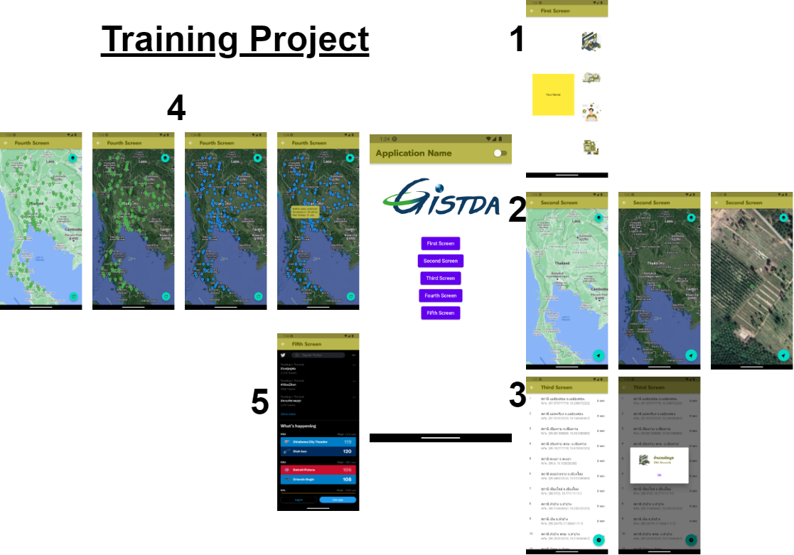

# :wave: Welcome to Flutter Manual's "Introduction to Flutter"

<details><summary>What is Flutter?</summary>
<hr>
  
## What is Flutter?
 - **Flutter** เป็น Framework ในการพัฒนา Mobile Application พัฒนาและสนับสนุนโดย Google สามารถพัฒนา app แบบ cross-platform โดยสามารถสร้างและใช้งานได้ใน iOS, Android, พร้อมกับ Desktop และใน Website Flutter ไม่ได้ compiled โดยตรงไปที่ Android หรือ iOS เลย แอพจะเปิดขึ้นได้ด้วยการทำงานร่วมกันของ rendering engine สร้างจาก C++ และ ใช้ Flutter Design UI ที่สร้างจาก Dart
 - **Tools**
   - [pub.dev](https://pub.dev/) : The official package repository for Dart and Flutter apps.
   - [Icon](https://fonts.google.com/icons) : Material Symbols
 - **Create Project**
    1. Open VS Code.
    2. Invoke View > Command Palette.
    3. Type “flutter”, and select the Flutter: New Project.
    4. Select Application.
    5. Create or select the parent directory for the new project folder.
    6. Enter a project name, ``training`` and press Enter. Note! The name should be all lowercase, with underscores to separate words (my_first_app).
    7. Wait for project creation to complete and the main.dart file to appear.
 - **Run the app**
    1. Locate the VS Code status bar. Select a device from the Device Selector area.
    2. Invoke Run > Start Debugging or press F5
    3. Wait for the app to launch—progress is printed in the Debug Console view.
    4. After the app build completes, you’ll see the starter app on your device.
    5. Change the string 
       ``You have `pushed` the button this many times``
      to
       ``You have `clicked` the button this many times``
    6. Save your changes.
    7. Emulator will show first Project of flutter for press '+' to increase counter result.
    8. Structure of Project
  
        📁 folder ``lib`` เก็บไฟล์ที่แยกหน้าแอพต่าง ๆ ที่นามสกุล .dart ซึ่งการทำงานบนหน้าจอต่าง ๆ จะอยู่ในโฟลเดอร์นี้
  
        📁 folder ``android``, ``ios`` ใช้สำหรับการเก็บโปรเจคของ Application แต่ละระบบ เมื่อทำการรันจะมีการเก็บลงตามระบบปฏิบัติการที่รัน ซึ่งสามารถทำการแก้ไขในแต่ละระบบปฏิบัติการ เช่น ถ้าหากเปลี่ยนชื่อ App ใน Android จะเปลี่ยนได้เฉพาะใน Android แต่ไม่ได้เปลี่ยนใน iOS ดังนั้น ชื่อแอพใน 2 ระบบปฏิบัติการจะไม่เหมือนกัน หากต้องการให้เหมือนกันต้องเปลี่ยนทั้ง 2 โฟลเดอร์
          - ``android`` This folder contains the Android-specific configuration and code for your Flutter project. It includes the AndroidManifest.xml file, build.gradle files, and other resources required for building and running your app on Android devices.
          - ``ios`` This folder contains the iOS-specific configuration and code for your Flutter project. It includes the Info.plist file, build settings files, and other resources required for building and running your app on iOS devices.
  
        📁 folder ``assets`` This folder contains any static assets, such as images or fonts, that are required by your app.
  
        🗄️ file ``pubspec.yaml`` ใช้สำหรับการตั้งค่าต่าง ๆ ให้กับโปรเจคหรือการเรียกใช้งานไลบราลีต่าง ๆ การประกาศไลบราลี ไอคอน ต้องทำการตั้งค่าในไฟล์นี้
  
        🗄️ file ``README.md`` This file provides information about your Flutter project, such as how to install and run it.

 - **First Project with Flutter**
    1. We've created Demo project with Material App. Material App's built which has Statefulwidget class. It has scafold widget is home of material app.
    2. In MyHomePage (Stateful widget) has incrementCouter function for set value of counter.
    3. In Scaffold Widget has AppBar and Body. Body has center widget with column of Text and counter value.
    4. In body, FloatactionButton with onpressed 'incrementCouter' and Icon widget to child.
     ```dart
     import 'package:flutter/material.dart';

     void main() {
       runApp(const MyApp());
     }

     class MyApp extends StatelessWidget {
       const MyApp({super.key});

       // This widget is the root of your application.
       @override
       Widget build(BuildContext context) {
         return MaterialApp(
           title: 'Flutter Demo',
           theme: ThemeData(
             // This is the theme of your application.
             //
             // Try running your application with "flutter run". You'll see the
             // application has a blue toolbar. Then, without quitting the app, try
             // changing the primarySwatch below to Colors.green and then invoke
             // "hot reload" (press "r" in the console where you ran "flutter run",
             // or simply save your changes to "hot reload" in a Flutter IDE).
             // Notice that the counter didn't reset back to zero; the application
             // is not restarted.
             primarySwatch: Colors.blue,
           ),
           home: const MyHomePage(title: 'Flutter Demo Home Page'),
         );
       }
     }

     class MyHomePage extends StatefulWidget {
       const MyHomePage({super.key, required this.title});

       // This widget is the home page of your application. It is stateful, meaning
       // that it has a State object (defined below) that contains fields that affect
       // how it looks.

       // This class is the configuration for the state. It holds the values (in this
       // case the title) provided by the parent (in this case the App widget) and
       // used by the build method of the State. Fields in a Widget subclass are
       // always marked "final".

       final String title;

       @override
       State<MyHomePage> createState() => _MyHomePageState();
     }

     class _MyHomePageState extends State<MyHomePage> {
       int _counter = 0;

       void _incrementCounter() {
         setState(() {
           // This call to setState tells the Flutter framework that something has
           // changed in this State, which causes it to rerun the build method below
           // so that the display can reflect the updated values. If we changed
           // _counter without calling setState(), then the build method would not be
           // called again, and so nothing would appear to happen.
           _counter++;
         });
       }

       @override
       Widget build(BuildContext context) {
         // This method is rerun every time setState is called, for instance as done
         // by the _incrementCounter method above.
         //
         // The Flutter framework has been optimized to make rerunning build methods
         // fast, so that you can just rebuild anything that needs updating rather
         // than having to individually change instances of widgets.
         return Scaffold(
           appBar: AppBar(
             // Here we take the value from the MyHomePage object that was created by
             // the App.build method, and use it to set our appbar title.
             title: Text(widget.title),
           ),
           body: Center(
             // Center is a layout widget. It takes a single child and positions it
             // in the middle of the parent.
             child: Column(
               // Column is also a layout widget. It takes a list of children and
               // arranges them vertically. By default, it sizes itself to fit its
               // children horizontally, and tries to be as tall as its parent.
               //
               // Invoke "debug painting" (press "p" in the console, choose the
               // "Toggle Debug Paint" action from the Flutter Inspector in Android
               // Studio, or the "Toggle Debug Paint" command in Visual Studio Code)
               // to see the wireframe for each widget.
               //
               // Column has various properties to control how it sizes itself and
               // how it positions its children. Here we use mainAxisAlignment to
               // center the children vertically; the main axis here is the vertical
               // axis because Columns are vertical (the cross axis would be
               // horizontal).
               mainAxisAlignment: MainAxisAlignment.center,
               children: <Widget>[
                 const Text(
                   'You have pushed the button this many times:',
                 ),
                 Text(
                   '$_counter',
                   style: Theme.of(context).textTheme.headlineMedium,
                 ),
               ],
             ),
           ),
           floatingActionButton: FloatingActionButton(
             onPressed: _incrementCounter,
             tooltip: 'Increment',
             child: const Icon(Icons.add),
           ), // This trailing comma makes auto-formatting nicer for build methods.
         );
       }
     }
     ```
</details>
<details><summary>Setup Flutter</summary>
<hr>
  
  ### 1. Install Flutter SDK
   - Get the Flutter SDK at: https://docs.flutter.dev/get-started/install/macos
   - If you setup in Mac Silicon, you must to install Rosetta
  
      ```shell  
      sudo softwareupdate --install-rosetta --agree-to-license
      ```
   - Extract the file in the desired location, for example:

      ```shell
      cd ~/Flutter
      unzip ~/Downloads/flutter_macos_3.3.2-stable.zip
      ```
   - Add the flutter tool to your path with 'pwd => path of flutter':
  
     ```shell
     vim .zshrc
     Press 'I'
        export PATH=/Users/username/Documents/Flutter/ENV/flutter/bin:$PATH
     Press ESC
     Type ':wq!'
     ```
     ```shell
     export PATH="$PATH:/Users/username/Documents/Flutter/ENV/flutter/bin"
     ```
   - Run Flutter doctor:
  
     ```shell
     flutter doctor
     ```
  ### 2. Install Xcode
   - Get the Xcode at: https://developer.apple.com/xcode/.
   - Configure the Xcode command-line tools to use the newly-installed version of Xcode by running the following from the command line:
  
     ```shell
     sudo xcode-select --switch /Applications/Xcode.app/Contents/Developer
     sudo xcodebuild -runFirstLaunch
     ```
   - Make sure the Xcode license agreement is signed by either opening Xcode once and confirming or running with command line:
     ```shell
     sudo xcodebuild -license
     ```
   - Set up the iOS simulator. On your Mac, find the Simulator via Spotlight or by using the following command:
  
     ```shell
     xcodebuild -downloadPlatform iOS
     curl -sSL https://raw.githubusercontent.com/rvm/rvm/master/binscripts/rvm-installer | bash -s stable
     gem install drb -v 2.0.6
     open -a Simulator
     ```
     if error:
     	clone https://github.com/CocoaPods/Xcodeproj
edit Gemfile.lock and xcodeproj.gemspec changing rexml version to 3.3.0
run rake build
run gem install rexml -v 3.3.0 (I did this with and without sudo)
run gem install --local pkg/xcodeproj-1.24.0.gem (I did this with and without sudo)
running again pod install in project folder and now completes normally
     
   - Install cocoapods
  
     ```shell
     sudo gem install cocoapods
     ```
  ### 3. Install Android Studio
   - Download and install [Android Studio](https://developer.android.com/studio).
   - Set up the Android emulator follow command recommendation.
   - Agree to Android Licenses:
      
     ```shell
     flutter doctor --android-licenses
      ```
  ### 4. Install VS Code
   - Install extension : Flutter, Dart, Highlight Matching Tag, Lorem ipsum, Dart Data Class, GitHub Pull Requests and Issues

</details>
<details><summary>Dart(101)</summary>
<hr>
  
## ⌨️ What is Dart?
  
 - **Dart** คือ ภาษาโปรแกรมที่เอาไว้สำหรับสร้างแอพพลิเคชันบนแพลตฟอร์มที่หลากหลายโดยได้ทั้ง mobile, desktop, server และก็ web ภาษา Dart นี้ถูกสร้างโดย Google และปล่อยให้ใช้งานแบบ open source ทำให้ทุกคนสามารถนำไปใช้งานได้ฟรีๆ และการที่ Dart ถูกออกแบบมาให้ใช้งานได้ง่ายและมีประสิทธิภาพแบบภาษาเชิงวัตถุอื่นๆอย่าง Java C# C++ Dart เป็นภาษาเชิงวัตถุ (Object-oriented programming) ดังนั้งสิ่งที่ขาดไม่ได้เลยก็คือ class นั่นเอง โดยครั้งนี้เรามาลองดูตัวอย่างผ่านการสร้าง class Bicycle

   1️⃣ Define a Bicycle class
     ```dart
     class Bicycle {
       int cadence;
       int _speed = 0;
       int get speed => _speed;
       int gear;

       Bicycle(this.cadence, this.gear);

       void applyBrake(int decrement) {
         _speed -= decrement;
       }

       void speedUp(int increment) {
         _speed += increment;
       }

       @override
       String toString() => 'Bicycle: $_speed km/h';
     }
     ```
     
   2️⃣ Main class
     ```dart
     void main() {
       var bike = Bicycle(2,1);
       print('Start : $bike');
       print('Cadence : ${bike.cadence}');
       print('Gear : ${bike.gear}');

       bike.speedUp(20);
       print('Speed after speedUp   : $bike');

       bike.applyBrake(8);
       print('Speed after applyBrake: $bike');
     }
     ```
     
   ☑️ Output
     ```
     Start : Bicycle: 0 km/h
     Cadence : 2
     Gear : 1
     Speed after speedUp   : Bicycle: 20 km/h
     Speed after applyBrake: Bicycle: 12 km/h
     ```
   ⏭️ จากโค้ดนี้จะเห็นว่า มีการประกาศคลาส Bicycle โดยมีตัวแปรที่อยู่ใสคลาสหรือ Attribute ด้วยกัน 3 ตัวคือ cadence (รอบขาในการปั่น), _speed (ความเร็ว), และ gear (เกียร์) ถ้าสังเกตจะเห็นว่าการประกาศคลาสนั้นไม่ต้องระบุ public, private หรือ protected เหมือนในภาษา Java โดยใน Dart นั้นทั้งหมดจะ public เป็นค่าเริ่มต้นอยู่แล้ว นอกจากนี้ยังมี Method ของการเพิ่มและลดความเร็วที่สามารถทำการเรียกใช้เพื่อปรับเปลี่ยนผลลัพธ์ให้กับจักรยานได้
  
## ⌨️ Variable
   - มาตรฐานการตั้งชื่อตัวแปร (Naming Convention)
     - Camel Case: สำหรับการตั้งชื่อตัวแปร โดยตัวแรกเป็นตัวพิมพ์เล็ก คั่นคำต่อไปด้วย ตัวอักษรพิมพ์ใหญ่ เช่น newProductPrice
     - Pascel Case: สำหรับการตั้งชื่อ Class โดยตัวแรกเป็นตัวพิมพ์ใหญ่คั่นคำต่อไปด้วย ตัวอักษรพิมพ์ใหญ่ เช่น MyUserName
     - Snake Case: สำหรับการตั้งชื่อ File or Folder โดยการใช้ตัวพิมพ์เล็ก คั่นคำต่อไปด้วย '_' เช่น number_of_client
   - File and Package name : ใช้การตั้งชื่อด้วยตัวอักษรตัวเล็กทั้งหมดไม่ต้องมี '_' คั่น

## ⌨️ Datatype
   - int : จำนวนเต็ม
   - double : ทศนิยม
   - num : ตัวเลขจำนวนเต็ม และทศนิยม
   - bool : true, false
   - string : ประโยค จะอยู่ใน " " หรือ ' ' (แนะนำให้ใช้แบบ single quote)
   - dynamic : ตัวแปรแบบเปลี่ยนชนิดได้ ซึ่งทุกตัวแปรสามารถเป็น null ได้ สามารถเปลี่ยนแปลง type ได้ตลอด
   - var : เป็นการประกาศชนิดตัวแปรด้วยโปรแกรม เมื่อมีการเลือกเป็น type ไหนแล้วจะเป็น type นั้นจนจบโปรแกรม
   - final : คล้าย var เปลี่ยน type ด้วยโปรแกรม แต่ไม่สามารถเปลี่ยนเป็นค่าอื่นได้ กรณีเป็น Reference/Object Data Types สามารถแก้ไขค่าได้ แต่ไม่สามารถกำหนดค่าให้ตัวแปรใหม่ได้
  
     ```dart
     // Primitive Data Types : int, double, boolean and string
     
     final String name = "NottDev";
     name = "NottDev Edit";  // can't set
     
     // Reference/Object Data Types : List, Map, Object
     
     final List<String> fruits = ['apple', 'orange', 'banana'];
     fruits.removeLast();  // ['apple', 'orange'];
     fruits = [];  // can't set
     ```
   - const : ตัวแปรที่มีกำหนดค่าได้ครั้งเดียว
  
     ```dart
     const Pi = 3.14;
     ```
 - Use => arrow functions.
 - Use {} multi-line functions.
   ฟังก์ชันที่มี return statement เดียวเท่านั้น เราก็สามารถเขียนย่อโดยใช้ Arrow Function ได้ Dart also supports a nice shorthand syntax for any function that has only one expression.
   ```dart
   int add(int x, int y) {
    return x + y;
   }

   // สามารถเขียนย่อได้ว่า

   add(x, y) => x + y;
   ```
 - Use ``//`` for single-line comments and ``/* */`` for multi-line comments.
 - Use ``;`` at the end of statements.
  
</details>
<details><summary>Widgets and Layouts</summary>
<hr>

## ▶️ Widget
 - **Widget** คือ ส่วนที่ถูกใช้สร้างเป็นหน้าตาของ App หรือ User Interface (UI) โดยนำมาประกอบเรียงกันเป็นลำดับขั้นขึ้นเป็นโครงสร้าง แต่ละ widget จะถูกวางซ้อนอยู่ภายใน Parent widget และได้รับการส่งต่อสืบทอดคุณสมบัติ (Properties) ต่างๆ จาก Parent อีกที แม้กระทั้ง application object ก็ถือเป็น widget ซึ่งเราเรียกว่า root widget 
 - **Flutter** จะมองทุกอย่างเกือบทั้งหมดเป็น widget มี ``MaterialApp`` เป็น root widget หรือ Widget หลัก ที่ทำหน้าที่กำหนดส่วนต่าง ๆ ของแอพ 
 - Widget แต่ละตัวจะมีส่วนที่เรียกว่า Properties สำหรับกำหนดคุณสมบัติให้กับ Widget นั้น ๆ ซึ่ง Widget แต่ละตัวก็มี Properties ที่หลากหลายให้เราใช้งานแตกต่างกันออกไป 
 - Widget สามารถจำแนกตามการใช้งาน ได้ดังนี้
    - ใช้กำหนดโครงสร้าง (Structural Element) เช่น ปุ่ม button หรือ menu
    - ใช้กำหนดลักษณะ หรือรูปแบบ (Stylistic Element) เข่น font หรือ color
    - ใช้จัดวาง และกำหนดมุมมองเลเอาท์ (Aspect of Layout) เช่น padding หรือ alignment

## ▶️ Layouts
 - **Layouts in Flutter**
  - Row และ Column -> Widget สำหรับการจัด Layout ที่ใช้บ่อยที่สุดในการกำหนดตำแหน่ง widget โดย Row Widget ใช้ในการแสดงผลในแนวนอน ส่วน Column Widget ใช้ในการแสดงผลในแนวตั้ง
    - แต่ละ Row และ Column มี child widget ได้หลายตัว
    - สำหรับจัดการ Layout ของหน้าแอพ แบบ Row เป็นการจัดเรียง Widget แบบซ้าย-ขวา ส่วน Column เป็นการจัดเรียงแบบบน-ล่าง ตามรูป
    <p align="center">
       
    </p>
    
    - Aligning widgets ของ Row และ Column ตามภาพ
    <p align="center">
       
 
       
    </p>
    
    - หากมีการแสดงผลมากเกินขนาดของหน้าจอต้องเปลี่ยน Row หรือ Column ให้เป็น ListView เพื่อให้สามารถทำการ Scroll ดูข้อมูลได้
     ```dart
      scrollDirection: Axis.horizontal  // เลื่อนในแนวนอน
      scrollDirection: Axis.vertical,   // เลื่อนในแนวตั้ง
     ```
  - Wrap -> Widget สำหรับการจัด Layout เมื่อมีการแสดงผลที่เกินขอบเขตการแสดงผลของหน้าจอ โดยจะทำการจัดเรียง Widget ให้มีจำนวนข้อมูลที่พอดีกับขอบเขตหน้าจอ คล้ายกับการทำ Row และ Column รวมกัน
  - Container -> Widget ทำหน้าที่เป็นพื้นที่สำหรับการรวม Widget ต่างๆ เอาไว้ (กล่องใส่ของ) มี Widget ภายในสามารถแบ่งออกเป็น Layer เรียงลำดับที่อยู่ของ Properties จากด้านนอกเข้าสู่ด้านในจะเป็น Margin > Border > Padding > Content ได้แบบนี้
    <p align="center">
      
    </p>
    
    - มี Properties ที่ชื่อ child ซึ่งสามารถบรรจุ Widget ได้หลายชนิด เช่น Row, Column, Image หรือว่าเป็น Container เอง ตัวใดตัวหนึ่งได้เพียงตัวเดียว
      <p align="center">
         
      </p>
    - ใช้ BoxDecoration สำหรับกำหนดรูปร่างของ Container เช่น สี ลักษณะรูปร่างของ Container
      ```dart
      Container(
        decoration: BoxDecoration(
          color: Colors.green,
          borderRadius: BorderRadius.circular(40),
        ),
        height: 50,
      ),
      ```
    - ใช้ Padding กำหนดระยะห่างของ Widget ออกจากขอบของ Layout
      ```dart
      Padding(
          padding: const EdgeInsets.all(8.0),
          child: Column(...),
      ),
      ```
    - ใช้ margin กำหนดระยะห่างของ Widget ออกจากขอบของหน้าจอแสดงผล
  - Stack -> สร้างลำดับการซ้อนทับของ Layout เวลาใช้งานให้มองภาพ 2D ให้เป็น 3D แล้วเรียบเรียงด้านหน้า-ด้านหลังของ Widget นั้น
  - ListView −> แสดงผล children widget เป็นแบบ list เมื่อมีการแสดงผลเกินพื้นที่หน้าจอสามารถทำการเลื่อนหน้าจอหรือ Scroll Down ได้
  - GridView −> แสดงผล children widget เป็นแบบ gallery
  - Expanded −> ใช้สำหรับการขยายความสูง children widget เพื่อให้เต็มพื้นที่การแสดงผล ผ่าน flex Properties
  - Table −> แสดงผลข้อมูลในรูปแบบตาราง
  - Flow −> แสดงผลข้อมูลในรูปแบบคลิกเพื่อแสดงข้อมูล
  - SizedBox -> ใช้สำหรับการกำหนดขนาดการแสดงผลของ Widget ที่อยู่ภายใน จะคล้ายกับการใช้งาน Container แต่จะกิน RAM น้อยกว่า แต่จะสามารถกำหนดได้เฉพาะความกว้าง ความยาวเท่านั้น กำหนดค่าอื่น ๆ ไม่ได้
  - Widget อื่น ๆ สามารถศึกษาเพิ่มเติมได้ที่ https://docs.flutter.dev/reference/widgets เช่น
    - Image Widget ที่เกี่ยวข้องกับรูปภาพ
      - Image.asset() ภาพจาก Package เดียวกับ App
      - Image.file() ภาพจาก การถ่ายรูปหรือดึงรูปภาพจากคลังภาพ
      - Image.memort() ภาพจาก ภาพที่มีการเข้ารหัส base64 ซึ่งเป็นในรูปแบบตัวอัีกษร การใช้งานต้องแปลงอักษรเหล่านี้ให้เป็นรูปภาพ
      - Image.network() ภาพจาก แหล่งภาพ online
    - Text Widget เกี่ยวข้องกับการใช้ตัวอักษร
    - Card Widget แสดงผลแบบการ์ด มีการกำหนด Attribution ที่ชื่อว่า elevation ในการกำหนดเงาให้การ์ด

## ▶️ State Widget
 - Stateless Widget เป็น Widget ที่ไม่มีการเปลี่ยนแปลงตัวเอง การแสดงผลจะมีลักษณะคงที่ไม่เปลี่ยนแปลง
 - Stateful Widget เป็น Widget ที่มีการเปลี่ยนแปลงของ state โดยจะมีการใช้งานคำสั่ง setState() เพื่อกำหนดการเปลี่ยนแปลง เป็นการบอกให้ flutter รู้ว่ามีบางอย่างเปลี่ยนแปลงเกิดขึ้นกับ State และ App ต้องทำการ rerun หรือทำคำสั่ง build() ใหม่ จึงได้รับผลจากการเปลี่ยนแปลงที่เกิดขึ้น
 - State Management : การจัดการ State ในหลาย ๆ หน้า มี 2 ส่วน คือ
    Provider : ดูแลและจัดการข้อมูลแล้วนำไปส่งให้ Consumer
    Consumer : นำข้อมูลที่ได้จาก Provider ไปสร้างหรือแสดงผลใน หน้าแอพหรือ widget ต้องทำการติดตั้ง package เพิ่มเติม คือ provider

## ▶️ Scaffold Widget
 - Scaffold คือ Widget หน้าต่างสำเร็จรูปสำหรับจัดการ Layout หรือโครงสร้างของหน้าแอป (มีการคำนวณระยะห่างของแอปกับหน้าจอ Emulator ให้อัตโนมัติ)
 - AppBar, which is a horizontal bar typically shown at the top of an app using the appBar property.
 - Body, The primary content of the scaffold.
 - FloatingActionButton ปุ่มที่มีลักษณะการแสดงผลแบบลอย ๆ ในมุมล่างขวามือ การใช้ปุ่มสามารถใส่ icon ได้ ด้วยการนำใส่ไปใน child:icon
   ```dart
   floatingActionButton: FloatingActionButton(
          onPressed: () {},
          child: Icon(Icons.add),
   )
   ```
   หากต้องการให้มีการเปลี่ยน State หลังจากการกด floattingButton ให้มีการกำหนดการเปลี่ยน state ใน onPressed
   ```dart
   ....
       onPressed: (){
         setState(() {
           number++;
         )};
       },
   ```
   สามารถทำการแยก setState() ออกเป็นฟังก์ชันแยกได้ เพื่อให้สะดวกต่อการแก้ไข
 - BottomNavigationBar, which is a horizontal array of buttons typically shown along the bottom of the app using the bottomNavigationBar property.

## ▶️ Navigation Widget
- Navigator Widget คือ กลุ่มของ widget หรือ class ที่ใช้ร่วมกับ route ในการจัดการ widget ย่อย
- มีการจัดวางโครงสร้างแบบ stack ซึ่งเป็นการซ้อนทับตามลำดับจากล่างขึ้นบน โดยแผ่่นที่นำมาเรียงต่อกันคือ ส่วนของ Widget ย่อย แผ่นที่แสดงผลจะถูกแสดงซ้อนทับหน้าอื่น ๆ ไว้
- Operator ของ Stack มีสองตัวคือ
  - Push : เป็นการนำสมาชิกใหม่มาไว้บนสุดของ stack สามารถทำการรับส่งข้อมูลระหว่างกันได้
    ```dart
    Navigator.push(
      context, 
      MaterialPageRoute(
        builder: (
          BuildContext context) {
            return Text("Page 2");
    }));
    ```
  - Pop : เป็นการนำสมาชิกชั้นบนสุดออกจาก stack

      App: page1 -> page2 -> page3(pop)

      To

      App: page1 -> page2 

    <p align="center">
       
    </p>
  - PushNamed : เป็นการเรียก widget ย่อย เพื่อให้ไปหน้า route ที่ต้องการ ใช้ในกรณีที่มีจำนวนหน้าซับซ้อน เช่น สมมุติว่าผู้อ่านอยู่ page1 และต้องการเปิดหน้าใหม่ก็จะเจอ page2 พอผู้อ่านอยู่ page2 และต้องการเปิดหน้าใหม่ก็จะเจอ page3 จะเป็นยังงี้ไปเรื่อยๆ

      App: page1(pushNamed(page2)) -> page2(pushNamed(page3) -> page3
 
  - pushReplacementNamed : เป็นการแทนที่หน้าที่เราอยู่ ณ ปัจจุบัน สมมุติว่าผู้อ่านอยู่ page1 เมื่อกด pushReplacementNamed จะมี page อื่นมาแทน โดยไม่สามารถ pop กลับไปก่อนหน้าได้

      App: page1(pushNamed(page2) <- page2

      To

      App: page2
  - popAndPushNamed : เหมือน PushReplacementNamed แต่ข้อแตกต่างคือเรื่องการแสดงผล animation flutter
    - pushReplacementNamed : Enter animation
    - popAndPushNamed : Exit animation
  - pushNamedAndRemoveUntil ใช้ในกรณีที่เราต้องการ push หน้าใหม่ขึ้นมาแล้วทำการลบหน้าที่ซ้อนๆ กันอยู่ด้านล่างของ Stack ทิ้งออกไป เวลากลับจะได้กลับไปหน้าที่ต้องการได้เลย มีลูกเล่นอยู่ 2 แบบคือ 
    - เคลียร์ทุกค่าที่อยู่ใน stack แล้วทำการเปิด page ที่ต้องการ เช่น page4
    ```dart
    Navigator.pushNamedAndRemoveUntil(context, '/page4', (Route<dynamic> route) => false);
    ```

      APP: page1 -> page2 -> page3(pushNamedAndRemoveUntil(page4) -> page4

      To

      App: page4
    - เคลียร์ค่าใน stack ตามที่ต้องการ เช่น ต้องการเปิด page4 แล้วเคลียร์ page2,3
    ```dart
    Navigator.pushNamedAndRemoveUntil(context, '/page4', ModalRoute.withName('/page1'));
    ```

      APP: page1 -> page2 -> page3(pushNamedAndRemoveUntil(page4),ModalRoute.withName(page1) -> page4

      To

      App: page1 -> page4
  - PopUntil : จะเป็นการ pop จนกว่าจะถึง page ที่ต้องการ เช่น pageA
    ```dart
    Navigator.of(context).popUntil(PageA);
    ```

      APP: pageA -> pageB -> pageC

      To

      APP: pageA
    <p align="center">
       
    </p>
  - SystemNavigator.pop() => ปิดแอพเพื่อออกไปหน้า Menu เครื่อง

</details>
  
<details><summary>API</summary>
<hr>

## ⤵️ API  
- API คือ วิธีเรียกใช้งานโปรแกรม เป็นรูปแบบโปรแกรมกับโปรแกรม เพื่อใช้สำหรับการแลกเปลี่ยนข้อมูลระหว่างกัน ผ่านทาง Internet โดย
    โปรแกรมต้นทาง จะเรียกว่า Server คอยเปิดและให้บริการข้อมูล
    โปรแกรมปลายทาง จะเรียกว่า Client สำหรับเรียกใช้บริการจาก Server
  - การทำงานของ API
    - ผู้ให้บริการจะเป็นคนกำหนดกฏการเรียกใช้งานข้อมูล ซึ่งก่อนทำการเรียกใช้งาน API จะต้องรู้ว่าใช้คำสั่งอะไร (1 คำสั่ง = 1 API) 
    - Request การส่งคำขอเพื่อใช้บริการ API
    - Response การตอบกลับข้อมูลตามคำขอที่ส่งไป (ได้หรือไม่ได้)
  - Open API คือ API ที่เปิดให้คนนอกสามารถเข้าถึงข้อมูลได้
  - Web API คือ การให้บริการข้อมูลผ่าน Website โดย HTTP ซึ่งอยู่ในรูปแบบ XML และ JSON ซึ่งข้อมูล (ภาพ,เสียง,ข้อมูลทางธุรกิจ) จะเรียกว่า Resource
    - HTTP Method คือ ตัวที่บ่งบอกการกระทำกับข้อมูล
      - Get Method สำหรับร้องขอข้อมูล
      - POST Method สำหรับสร้างข้อมูลใหม่
      - PUT Method สำหรับอัพเดทข้อมูล
      - DELETE Method สำหรับลบข้อมูล
    - การใช้งาน Web API ใน Flutter ต้องทำการติดตั้ง HTTP Package เพื่อรับ/ส่ง ข้อมูล
      - เรียกใช้งาน Web API ในส่วนของ initState() 
      - กรอก url ของ API ที่ต้องการ
      - ทำการทดสอบการผลแสดงข้อมูล ถ้าแสดงผลได้ปกติแปลว่าสามารถใช้งาน API นั้นได้ โดยข้อมูลที่เข้ามาถ้าอยู่ในรูปแบบ JSON ต้องทำการแปลงให้สามารถใช้งานใน dart ได้
        ```dart
        import 'package:http/http.dart' as http;  // ต้อง import package ก่อนการเรียกใช้งาน

         @override
         void initState() {
            super.initState();
            getExchangeRate();
         }
         Future<void> getExchangeRate() async {
            var url = "https://covid19.ddc.moph.go.th/api/Cases/today-cases-by-provinces";
            var response = await http.get(Uri.parse(url));
            print(response.body);
         }
         ```
       - แปลง JSON object ไปใช้ใน dart ด้วย https://app.quicktype.io/
  - API and Forward Port
    - Database on XAMPP (phpmyadmin)
    - API Provide with Postman
    - Forward Port with ngrok
       - start with Run ngrok.exe > type "ngrok http 80" for forward port 80
       - copy url at forward to emulator
       - Stop sharing a port on Ngrok with Run ngrok.exe > type "taskkill /f /im ngrok.exe"

  - More information for [Parse JSON in Dart/Flutter](https://codewithandrea.com/articles/parse-json-dart/)
## ⤵️ FutureBuilder
  - FutureBuilder ซึ่งเป็น async widgets
  - การทำงานของ Flutter มี 2 แบบ คือ
    - การทำงานแบบ Synchronous คือ การทำงานแบบตามลำดับ ต้องให้งานก่อนหน้าเสร็จก่อนถึงจะทำงานในขั้นตอนต่อไป
    - การทำงานแบบ Asynchronous หรือ Non-blocking คือ การทำงานที่สามารถสลับไปทำงานอื่นได้โดยไม่ต้องรอกัน ซึ่งต้องมีการพ่วงการใช้งานกับ Future
      - Future คือ การนำค่าที่เกิดขึ้นในอนาคตมาใช้งาน ซึ่งจะทำการเช็คข้อมูลที่เกิดขึ้นผ่าน State เช่น สมบูรณ์ (Complete), ไม่สมบูรณ์ (Incomplete) เป็นต้น เมื่อมีการทำงานแบบ Asynchronous จะมีการใช้งานร่วมกับคำสั่ง async และ await สำหรับรอให้ทำงานจนเสร็จ
        ```dart
        Future <return type> ชื่อ Future async {
            await .....;
        }
        ```
      - จำลองข้อมูลในอนาคตด้วย Future เช่น เราดึงข้อมูลผ่านเครือข่าย ก็จำเป็นจะต้องรอสักพักกว่าข้อมูลจะมา ก็เกิดเวลาที่ต้องรอขึ้น
      - เหตุผลที่ต้องรู้จักกับข้อมูล Future ก็เพราะว่า ตัว FutureBuilder widget ที่จะใช้งานจำเป็นต้องใช้ข้อมูล Future
      - รูปแบบการใช้งาน FutureBuilder
        ```dart
        FutureBuilder<String>( // กำหนดชนิดข้อมูล
          future: _calculation, // ข้อมูล Future, ฟังก์ชันที่ต้องการเรียกใช้ แบบ Future
          builder: (BuildContext context, AsyncSnapshot snapshot) { // สร้าง widget เมื่อได้ค่า snapshot ข้อมูลสุดท้าย
            if (snapshot.hasData) { // ถ้าได้ค่าข้อมูลสุดท้าย
              return Text('Completed');
            } else if (snapshot.hasError) { // ถ้ามี error
              return Text('${snapshot.error}');
            }
            return const CircularProgressIndicator(); // ค่าเริ่มต้น, แสดงตัว Loading. snapshot.connectionState == ConnectionState.waiting
          },
        ),
        ```
## ⤵️ การใช้งาน Http ดึงข้อมูลจาก Server มาแสดงใน Flutter
  - ติดตั้ง http package
  - กำหนดสิทธิ์การขอใช้งานเครือข่าย INTERNET สำหรับ Android : android > app > src > main > AndroidManifest.xml
    ```xml
    <manifest xmlns:android...>
      ...
      <uses-permission android:name="android.permission.INTERNET" />
      <application ...
    </manifest>
    ```
- จัดรูปแบบ Data Model ข้อมูลสำหรับรองรับข้อมูลจาก API
  - ศึกษาโครงสร้างของข้อมูลที่จะนำมาใช้
    ```json
    [
      {
        "userId": 1,
        "id": 1,
        "title": "sunt aut facere repellat provident occaeenderit",
        "body": "quia et suscipitnsuscipit recusatecto"
      }
    ]
    ```
  - จากรูปแบบข้างต้น เพื่อใช้งานก็ได้สามารถกำหนด Data Model สำหรับข้อมูลได้เป็นดังนี้ (โครงสร้างข้อมูล JSON String data ของเรามีด้วยกัน 4 ตัวคือ userID , id , title และ body เวลาสร้าง Data Model ไม่จำเป้นต้องใช้หมดทั้ง 4 ตัวก็ได้ อาจจะกำหนดแค่ id กับ title)
    ```dart
    class Article {
      final int userId;
      final int id;
      final String title;
      final String body;

      Article({
        required this.userId,
        required this.id,
        required this.title,
        required this.body,
      });

      // ส่วนของ name constructor ที่จะแปลง json string มาเป็น Article object
      factory Article.fromJson(Map<String, dynamic> json) {
        return Article(
          userId: json['userId'],
          id: json['id'],
          title: json['title'],
          body: json['body'],
        );
      }
    }
    ```
- กำหนดฟังก์ชันสำหรับดึงข้อมูล api ด้วย http package และการแปลงข้อมูล api ที่ได้มาในรูปแบบ JSON data เป็นในรูปแบบ List<Article> โดยใช้ฟังก์ชั่นของ Flutter มาช่วย
  ```dart
  Future getData() async { // สรัางฟังก์ชั่นดึงข้อมูล คืนค่ากลับมาเป็นข้อมูล Future
    var response = await http.get(Uri.parse([MyConstant.domain](http://27.254.170.14/api1))); // ทำการดึงข้อมูลจาก server ตาม url ที่กำหนด
    var jsonData = jsonDecode(response.body);
    List<APIData> apiData = [];
    for (var u in jsonData) {
      APIData _getData = APIData(u["id"].toInt(), u["geom"], u["descriptio"], DateTime.parse(u["time"]), u["copyright"], u["province"], u["stationnam"], u["rainfall_v"].toInt(), u["rainfall_u"], u["temperatur"].toInt(), u["temperat_1"], u["geojson"]);
      apiData.add(_getData);
    }
    return apiData; // return list of data
  }
  ```
- ฟังก์ชันทำการดึงข้อมูลให้ได้ข้อมูล JSON String data มาแล้วอ่านข้อมูลจากแต่ละ tag เพื่อนำมาใส่ใน _getData
- นำไปแสดงหรือใช้งานร่วมกับ FutureBuilder
- การใช้งาน ListView Widget
  - ListView Widget เป็น widget ที่ใช้ในการสร้างลิสรายการที่สามารถเลือนได้ โดยเรียงต่อกันเป็นแนว สามารถกำหนดลิสรายการเป็น widget ต่างๆ ส่วนใหญ่จะพบเห็นใช้บ่อยในการสร้างเป็นลิสรายการข้อความ  widget ยอ่ยหรือลิสรายการแต่ละรายการจะเรียงต่อหลังกันไปเรื่อยๆ ตามทิศทางการเลื่อน scroll ซึ่งเป็นได้ทั้งในแนวตั้งและแนวนอน ขึ้นอยู่กับการกำหนด
      - การใช้งาน ListView() โดยทั่วไปจะใช้เป็น ListTile ที่จะมีรูปแบบที่สามารถกำหนด ส่วนของ leading, title, subtitle และ trailing เหมาะสำหรับรายการที่มีจำนวนไม่มาก เช่น 4 - 10 รายการหรือไม่ควรเกินขอบเขต
        <p align="center">
             
        </p>
      - การใช้งาน ListView.builder() คล้ายกับ ListView แต่ลิสรายการจะไม่ถูกเรียกมาแสดงทั้งหมดในครั้งเดียว จะแสดงเฉพาะบางส่วนให้เต็มพื้นที่ที่มองเห็น และเมื่อทำการเลื่อน scroll ลงไปเพื่อแสดงรายการที่เหลือ ``ต้องกำหนด itemCount ไม่อย่างงั้นจะเกิด Range error นั่นคือไปวนลูปเพิ่มรายการเกินขอบเขตหรือเกินจำนวนที่มีจริง, itemBuilder จะสร้างรายการโดยเรียกใช้งานฟังก์ชั่น IndexedWidgetBuilder() โดยตัวฟังก์ชัน IndexedWidgetBuilder นี้จะวนลูป List หรืออาเรย์ของ context เมื่อเลื่อน scroll ลงไปเพื่อแสดงรายการเพิ่มเติม ก็จะทำการวนลูปแสดงรายการจาก index ที่เหลือต่อไปเรื่อยๆ
        <p align="center">
             
        </p>
      - การใช้งาน ListView.separated()
      - การใช้งาน ListView.custom()
</details>
 
<details><summary>Database</summary>
<hr>

- Local Database : การเก็บข้อมูลในพื้นที่เก็บข้อมูลในเครื่องนั้น ๆ สามารถเรียกใช้งานเมื่อต้องการ แต่ถ้าทำการลบหรือล้างแอพในเครื่องข้อมูลก็จะสูญหายไปด้วย
- รูปแบบการเก็บข้อมูล
  - SQL : Table, Row, Column, Primary Key
  - NoSQL : Collections, Document, Field, ObjectID
- ติดตั้ง Package สำหรับใช้งานฐานข้อมูล ดังนี้
  - Sembast : จัดการฐานข้อมูล
  - Path_Provider : ดึงตำแหน่งฐานข้อมูลของเครื่อง
  - Path : อ้างอิงตำแหน่งที่เก็บฐานข้อมูล
- การสร้าง Store คือ การระบุที่จัดเก็บข้อมูลในแอพว่าชื่ออะไร มีรูปแบบการจัดเก็บข้อมูลแบบใด (คล้ายๆกับการสร้างตารางในฐานข้อมูล) โดยใช้ intMapStoreFactory
- การทำงานของ Snapshot เป็นส่วนของการแก้ปัญหาการเก็บข้อมูลที่มีสภาพแวดล้อมที่แตกต่างกัน เช่น การเก็บข้อมูลใน Android หรือ iOS สภาพแวดล้อมของแต่ละ Platform แตกต่างกันโดยสิ้นเชิง ส่งผลให้การจัดการข้อมูลมีความยุ่งยากไปด้วย จึงมีแนวคิดในการสร้างประเภทข้อมูลที่สามารถทำให้ข้อมูลทำงานได้ในสภาพแวดล้อมต่างกันที่เรียกว่า RecordSnapshot
</details>

      
<details><summary>Form and Validate</summary>
<hr>

## ⏭️ Form
- การสร้างแบบฟอร์ม คือ การรับข้อมูล (Input) จากผู้ใช้ เช่น ข้อความ ตัวเลข วันเวลา หรือตัวเลือกต่าง ๆ ซึ่งมีโครงสร้าง 2 ส่วน คือ แบบฟอร์มและส่วนควบคุมการทำงานของแบบฟอร์ม (Controller)
- การจัดรูปแบบฟอร์ม
  - autofocus : สั่งโฟกัสที่ช่องรับข้อมูลในตอนเริ่มต้น
  - keyboardtype : กำหนดรูปแบบของช่องรับข้อมูล
- สร้างฟอร์ม key หรือ id ของฟอร์มสำหรับอ้างอิง
  ```
  final _formKey = GlobalKey<FormState>();
  ```
- สร้าง Form ด้วย widget
  ```dart
  Form(
    key: _formKey,
    child: Column(
      children: <Widget>[
      // กำหนด widget ที่จะใช้งานกับฟอร์ม, Add TextFormFields and ElevatedButton here.
      ],
    ),
  );
  ```
- การอ้างอิงฟอร์มที่กำลังใช้งาน ตรวจสอบความถูกต้องข้อมูลในฟอร์ม
  ```dart
  if (_formKey.currentState!.validate()) { //หากผ่าน 
    // แสดงข้อความ
  } else {}
  ```
- หลักการทำงานเบื้องต้น ถ้ายังไม่ได้กรอกข้อมูล เมื่อกดปุ่ม submit ฟอร์มก็จะตรวจสอบข้อมูลโดยทำการ validate และแจ้งให้กรอกข้อมูลก่อนส่ง หลังกรอกข้อมูล และกดส่งใหม่อีกครั้ง
- การใช้งาน TextFormField ซึ่งเป็น widget หลักที่มีการใช้งานร่วมกับฟอร์ม 
  ```dart
  TextFormField(
    cursorColor: Theme.of(context).cursorColor,
    initialValue: 'Input text', // ค่าเริ่มต้น
    maxLength: 20, // จำกัดความยาวตัวอักษร
    decoration: InputDecoration( // ตกแต่งการแสดงผล
      icon: Icon(Icons.favorite),
      labelText: 'Label text',
      labelStyle: TextStyle(
        color: Color(0xFF6200EE),
      ),
      helperText: 'Helper text',
      suffixIcon: Icon(
        Icons.check_circle,
      ),
      enabledBorder: UnderlineInputBorder( // การใส่กรอบให้พื้นที่แสดงผล
        borderSide: BorderSide(color: Color(0xFF6200EE)),
      ),
    ),
  ),
  ```
- ปัญหาพื้นที่กับการใช้งาน Form ใน Flutter จะมีในเรื่องของการใช้งานแป้นพิมพ์ เข้ามาเกี่ยวข้องเมื่อมีการกรอกข้อมูล และถ้าส่วนของข้อมูลในฟอร์มมีการเปลี่ยนแปลงในเรื่องของขนาดหรือพื้นที่การแสดงข้อมูล ซึ่งอาจจะมาจากการซ่อนหรือแสดงข้อความ error หรืออื่นๆ ดังนั้นต้องกำหนดการใช้งาน SingleChildScrollView widget ครอบส่วนของ ฟอร์มอีกที เพื่อให้รองรับการปรับขนาดของพื้นที่ให้สามารถเลื่อนได้ ก็จะไม่เกิดปัญหาในเรื่องของพื้นที่แสดงข้อมูล ดังนี้
  ```dart
  body: SingleChildScrollView(
    child: Form(  // ใช้งาน Form
      key: _formKey, // กำหนด key
  ....
  ```
- การรับค่าจากข้อมูลจาก TextFormField จะมีที่จะกำหนดหลักๆ อยู่ 3 - 4  จุด คือ
  1. กำหนดตัวแปรสำหรับ controller หรือเรียกว่าตัวควบคุม
  2. นำ controller ผูกกับฟอร์มฟิลด์ที่ต้องการ
      ```dart
      / กำหนดตัวแปรรับค่า
      final _text1 = TextEditingController();
      
      ....
      TextFormField(
        controller: _text1, // ผูกกับ TextFormField ที่จะใช้
        validator: Validators.required('Please enter some text'),
      ),
      ```
  3. อ้างอิงค่า และใช้งานผ่าน controller
  4. ยกเลิกการใช้งาน
      ```dart
      @override
      void dispose() {
        _text1.dispose(); // ยกเลิกการใช้งานที่เกี่ยวข้องทั้งหมดถ้ามี
        super.dispose();
      }
      ```

## ⏭️ Validate
- การ validate หรือการตรวจสอบความถูกต้องของข้อมูลใน TextFormField จะกำหนด callback ฟังก์ชั่นให้กับ validator property เงื่อนไขการตรวจสอบก็ขึ้นกับรูปแบบตามที่ต้องการ
- callback ฟังก์ชัน จะทำงานเมื่อฟอร์มมีการตรวจสอบความถูกต้อง หรือก็คือเมื่อใช้คำสั่ง validate() อย่างในตัวอย่าง
  ```dart
  if (_formKey.currentState!.validate()) { // ตรวจสอบความถูกต้องของข้อมูลในฟอร์ม
  ```
- กรณีต้องการให้เรียกใช้งานทันทีที่มีการกรอกข้อมูล การกำหนดลักษณะนี้ จะทำให้การกรอกและส่งข้อมูลเป็นไปอย่างรวดเร็ว เพราะหากเงื่อนไขผ่านในขณะกรอกข้อมูล ก็ไม่ต้องย้อนกลับมาแก้ไข เหมือนกรณีที่เช็คด้วย validate() จากฟอร์ม นั่นคือไม่ต้องรอกดปุ่ม submit ก็รู้ได้เลยว่าข้อมูลที่กรอกอยู่นั้นผ่านหรือยังไม่ผ่านการตรวจสอบ สามารถกำหนด
  ```dart
  autovalidateMode: AutovalidateMode.always,
  ```
- การกำหนด Form Validation ด้วย ``mixin`` สร้าง class ที่จัดการเกี่ยวกับการตรวจสอบความถูกต้องของข้อมูลในฟอร์ม โดยใช้ชื่อว่า validations.dart ดังนี้
  ```dart
  // เนื่องจากข้อมูลข้อความ error ที่ validator ต้องการเป็น FormFieldValidator<String> จึงต้องกำหนดการใช้งาน FormFieldValidator โดยใช้จาก widgets ดึงมาเฉพาะที่ต้องการโดยใช้คำว่า show FormFieldValidator
  import 'package:flutter/widgets.dart' show FormFieldValidator;

  // เนื่องจากไม่ได้กำหนด constructor และ property ใดๆ จึงใช้งานเป็น mixin เป็นรูปแบบหนึ่งของ class
  mixin Validators {
    // กำหนดฟังก์ชั่น สำหรับระบุฟิลด์ที่ต้องกรอก
    static FormFieldValidator<String> required(String errMsg) {
      return (value) {
          if(value == null){
            return errMsg;
          }else if(value.isEmpty){
            return errMsg;
          }
      };
    }

    // กำหนดฟังก์ชั่น สำหรับระบุฟิลด์ต้องกรอกตัวเลขต่ำสุดอย่างน้อย
    static FormFieldValidator<String> min(int min,String errMsg) {
      return (value) => (int.parse(value!) >= 0 && int.parse(value) < min) ? errMsg : null;
    }  

    // กำหนดฟังก์ชั่น สำหรับระบุฟิลด์ต้องกรอกตัวเลขสูงสุดอย่างน้อย
    static FormFieldValidator<String> max(int max,String errMsg) {
      return (value) => (int.parse(value!) >= 0 && int.parse(value) > max) ? errMsg : null;
    } 

    // กำหนดฟังก์ชั่น สำหรับระบุฟิลด์ต้องกรอกตัวอักษรยาวน้อยสุด
    static FormFieldValidator<String> minLength(int minLength,String errMsg) {
      return (value) => (value!.isNotEmpty && value.length < minLength) ? errMsg : null;
    }  

    // กำหนดฟังก์ชั่น สำหรับระบุฟิลด์ต้องกรอกตัวอักษรยาวมากสุดไม่เกิน
    static FormFieldValidator<String> maxLength(int maxLength,String errMsg) {
      return (value) => (value!.isNotEmpty && value.length > maxLength) ? errMsg : null;
    }   

    // กำหนดฟังก์ชั่น สำหรับระบุฟิลด์ต้องกรอกข้อมูลตามรูปแบบ RegEex
    static FormFieldValidator<String> pattern(RegExp pattern,String errMsg) {
      return (value) => (value!.isNotEmpty && !pattern.hasMatch(value) ) ? errMsg : null;
    } 

    // กำหนดฟังก์ชั่น สำหรับระบุฟิลด์ต้องกรอกข้อมูลอีเมลที่ถูกต้องตามรูปแบบ
    static FormFieldValidator<String> email(String errMsg) {
      final emailPattern = RegExp(r"^[a-zA-Z0-9.a-zA-Z0-9.!#$%&'*+-/=?^_`{|}~]+@[a-zA-Z0-9]+\.[a-zA-Z]+");
      return (value) => (value!.isNotEmpty && !emailPattern.hasMatch(value) ) ? errMsg : null;
    }

    // กำหนดฟังก์ชั่น สำหรับระบุฟิลด์ต้องใช้งานการตรวจสอบหลายๆ คำสั่งรวมกัน
    static FormFieldValidator<String> compose(List<FormFieldValidator<String>> validators) {
      return (value) {
        for (final validator in validators) {
          if (validator(value) != null) return validator(value);
        }
        return null;
      };
    }

  }
  ```
  - ตัวอย่างการใช้งานใน TextFormField การกำหนดแบบหลายเงื่อนไขเพื่อให้ทำงานแบบมีประสิทธิภาพ ควรลำดับการตรวจสอบด้วย เช่น สมมติข้างต้นต้องการให้กรอกปี ค.ศ. ตั้งแต่ 2000 - 3000 อย่างแรกก็ต้องให้กรอกข้อมูล ต่อมาต้องเป็นตัวเลข ต่อมาต้องเป็นตัวเลข 4 ตัวขึ้นไป ต่อมาต้องเป็น ต่ำสุด และสูงสุด ตามลำดับ เพราะสมมติว่า ถ้า minLength หรือจำนวนตัวอักขระที่กรอก 4 ตัวขึ้นก่อนการเช็คว่าเป็นตัวเลข  ก็จะกลายเป็นว่า กรอกเป็นตัวอักษร ก็ผ่านแต่ไม่ผ่านต้องเป็นตัวเลข ดังนั้นก็ให้ไม่ผ่านตั้งแต่กรอกตัวอักษรเลย จะเป็นวิธีที่ถูกต้อง
    ```dart
    TextFormField(
      autovalidateMode: AutovalidateMode.always,
      // validator: Validators.required('Please enter some text'), // แบบกำหนดเงื่อนไขเดียว
      validator: Validators.compose([ // แบบกำหนดหลายเงื่อนไข 
        Validators.required('Please enter some text'),
        // Validators.email('Please enter a valid email'),
        Validators.pattern(RegExp(r'^([0-9])+$'), 'Only numberic'),
        Validators.minLength(4,'Please enter 4 digit'),
        Validators.min(2000,'Please enter a number between 2000 and 3000 '),
        Validators.max(3000,'Please enter a number between 2000 and 3000 '), 
      ])
    ),
    ```
- การกำหนด Form Validation ด้วย form_field_validator package ตัวช่วยในการจัดการตรวจสอบความถูกต้องของข้อมูลฟอร์มเบื้องต้น
  - ติดตั้ง form_field_validator
  - ตัวอย่างการเรียกใช้งาน
    ```dart
    // แบบเงื่อนไขเดียว
    TextFormField(
      autovalidateMode: AutovalidateMode.always,
      validator: RequiredValidator(errorText: 'this field is required'),
    ),

    // แบบหลายเงื่อนไข
    TextFormField(
      autovalidateMode: AutovalidateMode.always,
      validator: MultiValidator([  
        RequiredValidator(errorText: 'Please enter some text'),
        // EmailValidator(errorText: 'Please enter a valid email'),  
        MinLengthValidator(4, errorText: 'Please enter 4 digit'),  
        PatternValidator(r'^([0-9])+$', errorText: 'Only numberic'),
        RangeValidator(min: 2000, max: 3000, errorText: 'Please enter a number between 2000 and 3000'),
     ]),
    ```
</details>

<details><summary>Map</summary>
<hr>

## 🗺️ Google Map
- การติดตั้ง Google Maps for Flutter เบื้องต้น
  1. ขอ API Key จากลิงค์ https://cloud.google.com/maps-platform/
  2. ทำการ Enable เพื่อที่จะเรียกใช้ API (Enable Maps SDK for Android / IOS)
  3. เข้าไปที่เมนู Credentials เพื่อที่จะสร้าง API Key เอาไปแปะในโค้ดให้เชื่อมต่อกับ Google Cloud Platform
      Create Credentials -> API Key
- นำ API Key มาใช้
  - Android : เพิ่ม API Key ที่ไฟล์ AndroidManifest.xml ในโฟลเดอร์ android/app/src/main/AndroidManifest.xml
    ```xml
    <manifest xmlns:android="http://schemas.android.com/apk/res/android"
    package="com.example.fluttergooglemap">
    // ส่วนที่เพิ่มเติม เพื่อทำการกำหนด Permission
    <uses-permission android:name="android.permission.ACCESS_FINE_LOCATION"/>
    <uses-permission android:name="android.permission.ACCESS_COARSE_LOCATION"/>

    <application
        android:name="io.flutter.app.FlutterApplication"
        android:label="fluttergooglemap"
        android:icon="@mipmap/ic_launcher">
        // ส่วนที่เพิ่มเติม นำ API Key ที่ได้มาแทนใน "YOUR API KEY"
        <meta-data android:name="com.google.android.geo.API_KEY"
            android:value="YOUR API KEY"/>

        <activity
            android:name=".MainActivity"
            ...
     ```
     Set the minSdkVersion in android/app/build.gradle:
     ```
     android {
        defaultConfig {
            minSdkVersion 20 // เดิมเป็น minSdkVersion flutter.minSdkVersion
          }
      }
      ```
  - iOS : เข้าไปที่ไฟล์ AppDelegate.swift (ios/Runner/AppDelegate.swift) เพิ่ม API KEY เข้าไป GMSServices.provideAPIKey("YOUR KEY HERE")
    ```
    @UIApplicationMain
    @objc class AppDelegate: FlutterAppDelegate {
      override func application(
        _ application: UIApplication,
        didFinishLaunchingWithOptions launchOptions: [UIApplication.LaunchOptionsKey: Any]?
      ) -> Bool {
      GMSServices.provideAPIKey("YOUR API KEY")
        GeneratedPluginRegistrant.register(with: self)
        return super.application(application, didFinishLaunchingWithOptions: launchOptions)
      }
    }
    ```
    และเข้าไปที่ไฟล์ info.plist เพิ่มคำสั่ง เพื่อขอ permission
    ```xml
    <dict>
     <key>NSLocationWhenInUseUsageDescription</key>
          <string>This app needs your location to test the location feature of the Google Maps plugin.</string>
          <key>io.flutter.embedded_views_preview</key>
          <true/>
     ...
    ```
  - ติดตั้ง google_maps_flutter จาก pub.dev ใน pubspec.yaml
  - import Library
    ```dart
    import 'package:google_maps_flutter/google_maps_flutter.dart';
    ```
  - สร้างตัวแปรประเภท GoogleMapController โดยเป็น class ที่เอาไว้สร้าง Future สำหรับควบคุมการทำงาน
    ```dart
    class _MyHomePageState extends State<MyHomePage> {
      Completer<GoogleMapController> _controller = Completer();
    ```
  - การใช้งาน GoogleMap จะต้องทำการ initialCameraPosition เสมอ เพื่อกำหนดพิกัดจุดเริ่มต้นสถานที่ให้ GoogleMap ทำการแสดงผล
    ```dart
    body: GoogleMap(
        initialCameraPosition: CameraPosition(
          target: LatLng(13.757429, 100.502465), //กำหนดพิกัดเริ่มต้นบนแผนที่
          zoom: 15, //กำหนดระยะการซูม สามารถกำหนดค่าได้ 0-20
        ),
        onMapCreated: (GoogleMapController controller) {
          _controller.complete(controller);
        },
      ),
    ```
      
## 🗺️ Flutter Map
   - Mapping package for Flutter, based off of 'leaflet.js'. Simple and easy to learn, yet completely customizable and configurable, it's the best choice for mapping in your Flutter app.
   - Demonstration
     This code snippet demonstrates everything you need for a simple map - of course, FlutterMap is much more customisable than just this!
     ```dart
     return FlutterMap(
         options: MapOptions(
            center: LatLng(51.509364, -0.128928),
            zoom: 9.2,
         ),
         nonRotatedChildren: [
            TileLayer(
                urlTemplate: 'https://tile.openstreetmap.org/{z}/{x}/{y}.png',
            ),
        ],
     );
     ```
   - Map Layer
     ```
     Sphere Basemap > 'https://basemap.sphere.gistda.or.th/tiles/sphere_streets/EPSG3857/{z}/{x}/{y}.png?key=test2022'
     Sphere Satellite > 'https://basemap.sphere.gistda.or.th/tiles/thailand_images/EPSG3857/{z}/{x}/{y}.jpeg?key=test2022'
     Google Basemap > 'https://mt1.google.com/vt/lyrs=r&x={x}&y={y}&z={z}'
     Google Satellite > 'https://mt1.google.com/vt/lyrs=y&x={x}&y={y}&z={z}'
     ```
   - Marker Layer
     ```dart
     FlutterMap(
         options: MapOptions(),
         children: [
            MarkerLayer(
                markers: [
                   Marker(
                     point: LatLng(30, 40),
                     width: 80,
                     height: 80,
                     builder: (context) => FlutterLogo(),
                   ),
                ],
            ),
         ],
     ),
     ```
   - Get data from API
   - More data [Flutter Map Document](https://docs.fleaflet.dev/)
      
## 🗺️ Sphere Map
การเริ่มต้น sphere map flutter
- Get package sphere_maps_flutter(lastest version) from pub.dev and install
การเพิ่ม Sphere map widget
- Define parameter
  ```
  final map = GlobalKey<SphereMapState>();
  final GlobalKey<ScaffoldMessengerState> messenger = GlobalKey<ScaffoldMessengerState>();
  ```
- import Spheremap to body
  ```
  SphereMapWidget(
    apiKey: "", // use sphere key
    bundleId: "",
    key: map,
  ),
  ```
- ปิดการหมุนแผนที่
  ```dart
  widget.map.currentState?.call("Renderer.touchZoomRotate.disableRotation");
  ```
- ปิดการใช้งานเครื่องมือแผนที่มาตรฐานของ Sphere map
  ```dart
  options: {
              "ui": Sphere.SphereStatic("UiComponent", "None"),
            },
  ```
- การเรียกใช้งาน WMS จาก ArcGIS Server ต้องกำหนด "id" เนื่องจาก ArcGIST Server มีการกำหนดชื่อ Layer เป็นตัวเลข ทำให Spheremap มองเห็นเป็น layer เดียวกัน
  ```dart
      final layerPM = Sphere.SphereObject("Layer", args: [
      "0",
      {
        "url": pmMap,
        "type": Sphere.SphereStatic("LayerType", "WMS"),
        "opacity": 0.8,
        "zIndex": 5,
        "id": "unique_1",
      }
    ]);
  ```

</details>

<details><summary>Webview</summary>
<hr>

 - WebView widget เป็น package ที่เราจะต้องติดตั้งเพิ่ม เพื่อใช้งานใน flutter ใช้สำหรับแสดงหน้าเว็บเพจใน flutter
 - เตรียมข้อมูลสำหรับใช้งาน WebView
    - ติดตั้ง WebView package
    - กำหนด API level ของ android ต่ำสุดที่รองรับ จะต้องกำหนดเป็น 19 หรือ 20 ขึ้นไป โดยให้ไปแก้ไขที่ไฟล์ build.gradle กำหนด minSdkVersion เป็น 19 ตามรูป ถ้าเราไม่กำหนด จะไม่สามารถ build ผ่านได้
      <p align="center">
         
      </p>
 - การกำหนดและใช้งาน WebView
    - Ref:  https://www.ninenik.com/%E0%B8%81%E0%B8%B2%E0%B8%A3%E0%B9%83%E0%B8%8A%E0%B9%89%E0%B8%87%E0%B8%B2%E0%B8%99_WebView_%E0%B9%81%E0%B8%AA%E0%B8%94%E0%B8%87%E0%B9%80%E0%B8%A7%E0%B9%87%E0%B8%9A%E0%B9%84%E0%B8%8B%E0%B8%95%E0%B9%8C_%E0%B9%83%E0%B8%99_Flutter-1043.html

</details>

<details><summary>Datetime</summary>
<hr>

1. ประกาศ ตัวแปรชนิด String เพื่อรับ DateFormat
    ```dart
    String _dateTime = DateFormat("dd MMMM yyyy").format(DateTime.now());
    ```
2. การใช้ dateformat ต้องติดตั้ง Package intl
    ```dart
    import 'package:intl/intl.dart';
    ```
3. นำ _datetime ไปใส่ใน Text widget
4. Change date with datepicker with icon ``Icons.arrow_drop_down``
    ```dart
    IconButton(
        onPressed: () async {
            DateTime? pickedData = await showDatePicker(
                context: context,
                initialDate: DateTime.now(),
                firstDate: DateTime(2000),
                lastDate: DateTime(2050),
            );
            if (pickedData != null) {
                setState(() {
                    _dateTime = DateFormat("dd MMMM yyyy").format(pickedData);
                });
            }
        },
        icon: const Icon(Icons.arrow_drop_down),
    ),
    ```
</details>

<details><summary>Change Application Icon</summary>
<hr>

1. Call Package ``flutter_launcher_icons`` and install package
2. Create a folder called asset in the root directory. Inside the asset folder create one more folder called icons and place your launcher icon inside. ``Hint: It’s recommended to use a higher resolution image, for example, the image of 1024*1024.``
3. Add flutter_icons inside the pubspec.yaml to reference the new launcher icon. ``Note: foreground icon is smaller than image size with color background``
    ```yaml
    flutter_icons:
    android: true
    ios: true
    image_path: "assets/icons/bar-chart.png"
    adaptive_icon_background: "#ed1e79"
    adaptive_icon_foreground: "assets/icons/bar-chart_fore.png"
    ```
4. In terminal, use ``flutter pub run flutter_launcher_icons:main`` for run the app and verify the new launcher icon updated in the launcher app for both Android and iOS. 

</details>    

<details><summary>Chart</summary><blockquote>

<details><summary>syncfusion_flutter_charts</summary><blockquote>
	
1. Get package ``syncfusion_flutter_charts`` and install
2. Add SfCartesianChart or other type to code
    ```dart
    SfCartesianChart(
      title: ChartTitle(text: 'Half yearly sales analysis'),
      legend: Legend(isVisible: true),
      primaryXAxis: CategoryAxis(),
      series: <ChartSeries>[
        // Initialize line series
        LineSeries<ChartData, String>(
          enableTooltip: true,
          dataSource: [
            // Bind data source
            ChartData('Jan', 35),
            ChartData('Feb', 28),
            ChartData('Mar', 34),
            ChartData('Apr', 32),
            ChartData('May', 40)
          ],
          xValueMapper: (ChartData data, _) => data.x,
          yValueMapper: (ChartData data, _) => data.y,
          dataLabelSettings: const DataLabelSettings(isVisible: true),
        ),
      ],
    ),
    ```
3. Create class ChartData for model of data
    ```dart
    class ChartData {
      ChartData(this.x, this.y);
      final String x;
      final double? y;
    }
    ```
4. Add tooltip for show information of point with parameter 
    ```dart
    late TooltipBehavior _tooltipBehavior;
    ```
5. Get TooltipBehavior at initial state
    ```dart
    _tooltipBehavior = TooltipBehavior(enable: true);
    ```
6. In chart widget, add _tooltipBehavior for tooltipBehavior
    ```dart
    tooltipBehavior: _tooltipBehavior,
    ```
</blockquote></details>
<details><summary>charts_flutter</summary><blockquote>

1. Get package ``charts_flutter`` and install [ref.](https://google.github.io/charts/flutter/gallery.html)
2. Create class ChartData for model of data
    ```dart
    import 'package:charts_flutter/flutter.dart' as charts;
    
    class ChartData {
      final String id;
      final String year;
      final int sales;
      final charts.Color barColor;

      ChartData({
        required this.id,
        required this.year,
        required this.sales,
        required this.barColor,
      });
    }
    ```
3. Create class ChartsFlutter for config chart style
    ```dart
    import 'package:flutter/material.dart';
    import 'package:charts_flutter/flutter.dart' as charts;
    import 'datamodel.dart';
    
    class ChartsFlutter extends StatelessWidget {
      final List<List<ChartData>> data;
      const ChartsFlutter({super.key, required this.data});

      @override
      Widget build(BuildContext context) {
        List<charts.Series<ChartData, String>> series = [];
        for (var element = 0; element < data.length; element++) {
          series.add(
            charts.Series(
              id: data[element].first.id,
              data: data[element],
              domainFn: (ChartData series, _) => series.year,
              measureFn: (ChartData series, _) => series.sales,
              colorFn: (ChartData series, _) => series.barColor,
            ),
          );
        }
        return Container(
          height: 300,
          padding: const EdgeInsets.all(20),
          child: Card(
            child: Column(
              children: [
                Text(
                  'World of Flutter Subscribers by Year',
                  style: Theme.of(context).textTheme.headlineSmall,
                ),
                Expanded(
                  child: charts.BarChart(series,
                    animate: true,
                    barGroupingType: charts.BarGroupingType.grouped,
                    vertical: true, // 'false' in horizontal
                    behaviors: [
                      charts.SeriesLegend(
                        position: charts.BehaviorPosition.bottom,
                      ),
                    ],
                    defaultRenderer: charts.BarRendererConfig(
                      // By default, bar renderer will draw rounded bars with a constant radius of 100.
                      // To not have any rounded corners, use [NoCornerStrategy]
                      // To change the radius of the bars, use [ConstCornerStrategy]
                      cornerStrategy: const charts.ConstCornerStrategy(10),
                    ),
                    primaryMeasureAxis: const charts.NumericAxisSpec(
                      tickProviderSpec: charts.BasicNumericTickProviderSpec(
                        desiredTickCount: 5,
                      ),
                    ),
                  ),
                ),
              ],
            ),
          ),
        );
      }
    }
    ```
4. Add example data of saling to code and show ChartsFlutter in body
    ```dart
    class _MyHomePageState extends State<MyHomePage> {
      final desktopSalesData = [
        ChartData(
          id: 'Desktop',
          year: '2014',
          sales: 5,
          barColor: charts.ColorUtil.fromDartColor(Colors.blue),
        ),
        ChartData(
          id: 'Desktop',
          year: '2015',
          sales: 25,
          barColor: charts.ColorUtil.fromDartColor(Colors.blue),
        ),
        ChartData(
          id: 'Desktop',
          year: '2016',
          sales: 100,
          barColor: charts.ColorUtil.fromDartColor(Colors.blue),
        ),
        ChartData(
          id: 'Desktop',
          year: '2017',
          sales: 75,
          barColor: charts.ColorUtil.fromDartColor(Colors.blue),
        ),
      ];
      final tabletSalesData = [
        ChartData(
          id: 'Tablet',
          year: '2014',
          sales: 25,
          barColor: charts.ColorUtil.fromDartColor(Colors.red),
        ),
        ChartData(
          id: 'Tablet',
          year: '2015',
          sales: 50,
          barColor: charts.ColorUtil.fromDartColor(Colors.red),
        ),
        ChartData(
          id: 'Tablet',
          year: '2016',
          sales: 10,
          barColor: charts.ColorUtil.fromDartColor(Colors.red),
        ),
        ChartData(
          id: 'Tablet',
          year: '2017',
          sales: 20,
          barColor: charts.ColorUtil.fromDartColor(Colors.red),
        ),
      ];
      final mobileSalesData = [
        ChartData(
          id: 'Mobile',
          year: '2014',
          sales: 10,
          barColor: charts.ColorUtil.fromDartColor(Colors.yellow),
        ),
        ChartData(
          id: 'Mobile',
          year: '2015',
          sales: 15,
          barColor: charts.ColorUtil.fromDartColor(Colors.yellow),
        ),
        ChartData(
          id: 'Mobile',
          year: '2016',
          sales: 50,
          barColor: charts.ColorUtil.fromDartColor(Colors.yellow),
        ),
        ChartData(
          id: 'Mobile',
          year: '2017',
          sales: 45,
          barColor: charts.ColorUtil.fromDartColor(Colors.yellow),
        ),
      ];
      @override
      Widget build(BuildContext context) {
        return Scaffold(
          body: Center(
            child: ChartsFlutter(
              data: [desktopSalesData, tabletSalesData, mobileSalesData],
            ),
          ),
        );
      }
    }
    ```
</blockquote></details>	
</details>

<details><summary>Flutter Firebase</summary>
<hr>

1. Firebase คือ ฐานข้อมูลประเภท NoSQL ซึ่งไม่ใช้ภาษา SQL ในการจัดการข้อมูล ถูกออกแบบให้มีความยืดหยุ่นต่อการใช้งานและเน้นความรวดเร็วในการใช้งาน มีการเก็บข้อมูลในรูปแบบของ JSON ทำให้สามารถเพิ่มข้อมูลไปใน Object ใดๆ ก็ได้ แต่จะไม่สามารถเก็บเป็น Array ได้ ถ้าต้องการเพิ่มข้อมูลแบบอาร์เรย์จะต้องใช้การ Put ข้อมูลเข้าไปต่อท้ายเรื่อยๆ และจะมีการสร้าง Key ไว้ใช้สำหรับการอ้างอิง 
2. โครงสร้างการเก็บข้อมูลบน Cloud Firebase จะมีการเก็บแบบ Document Database ทั้งหมด 3 ส่วน คือ
    - Collection : เป็นเหมือน Folder ที่ไว้เก็บเอกสาร และมีชื่อบอกว่าเก็บเอกสารเกี่ยวกับอะไร
    - Document : เป็นเหมือนกระดาษไว้สำหรับเก็บข้อมูล โดยเก็บข้อมูลเป็น Object มีชื่อบอกว่าเก็บข้อมูลเกี่ยวกับอะไร และยังสามารถเก็บ Folder (Collection) ได้อีกด้วย 
    - Data : เป็นที่เก็บข้อมูล
3. รูปแบบของข้อมูลบน Firestore
    - String
    - Number
    - Boolean
    - Map
    - Array
    - Null
    - Timestamp
    - Geopoint
4. ขั้นตอนการสร้างโปรเจค Firebase
    1. สร้าง Account ที่ https://firebase.google.com/
    2. สร้างโปรเจคใหม่ คลิก Add Project ตั้งชื่อ Project แล้วคลิก Continue
    3. ปิด Google Analytics for this project แล้วคลิก Create project
    4. ทำการ Register App ตามระบบปฏิบัติการที่ใช้ โดยสามารถเลือกใช้ Flutter ได้ด้วย จากนั้นทำการติดตั้งตามคำแนะนำ ซึ่งจะช่วยให้การติดตั้งสะดวกมากขึ้น
    5. ในขั้นตอนการติดตั้ง Firebase for Flutter จะต้องทำการสร้าง Flutter Project ก่อนเพื่อให้การ Register สามารถทำกับ Project ที่ต้องการได้ทันที
    6. ใน Android ต้องทำการ config values accessible to Firebase SDKs ใน Root-level (project-level) Gradle file (<project>/build.gradle):
    	```
		buildscript {
		  repositories {
		    // Make sure that you have the following two repositories
		    google()  // Google's Maven repository
		    mavenCentral()  // Maven Central repository
		  }
		  dependencies {
		    ...
		    // Add the dependency for the Google services Gradle plugin
		    classpath 'com.google.gms:google-services:4.3.15'
		  }
		}
		allprojects {
		  ...
		  repositories {
		    // Make sure that you have the following two repositories
		    google()  // Google's Maven repository
		    mavenCentral()  // Maven Central repository
		  }
		}
		```
	
	และ add both the google-services plugin and any Firebase SDKs that you want to use ใน Module (app-level) Gradle file (<project>/<app-module>/build.gradle):
	
		plugins {
		  id 'com.android.application'
		  // Add the Google services Gradle plugin
		  id 'com.google.gms.google-services'
		  ...
		}
		dependencies {
		  // Import the Firebase BoM
		  implementation platform('com.google.firebase:firebase-bom:31.2.3')
		  // TODO: Add the dependencies for Firebase products you want to use
		  // When using the BoM, don't specify versions in Firebase dependencies
		  // https://firebase.google.com/docs/android/setup#available-libraries
		}
5. การเชื่อมโยง Firebase Authentication เข้ามาใน Flutter Project
    1. ทำการ Login >> ``firebase login``
    2. ติดตั้ง FlutterFire CLI >> ``dart pub global activate flutterfire_cli`` และ export path
    3. ทำการเลือก Project ใน Firebase ที่ต้องการติดตั้ง >> ``flutterfire configure`` พร้อมทำการ Config ตามต้องการ ตรวจสอบไฟล์ ``firebase_options.dart``
    4. ติดตั้ง Package ``flutter pub add firebase_core`` และ ``flutter pub add firebase_auth``
    5. ใน Main.dart : Add initial widget binding
		```dart
		WidgetsFlutterBinding.ensureInitialized();
		await Firebase.initializeApp(
		  options: DefaultFirebaseOptions.currentPlatform,
		);
		```
    6. ใน auth_page.dart : ทำการ Stream ข้อมูลเพื่อตรวจสอบ โดยย้าย Login page เข้ามาใน Class หากข้อมูลที่กรอกเข้ามามีอยู่ใน firebase ให้ไปต่อ ในตัวอย่างให้ไป Homepage()
		```dart
		body: StreamBuilder<User?>(
		  stream: FirebaseAuth.instance.authStateChanges(),
		  builder: (context, snapshot) {
		    // User loged in
		    if (snapshot.hasData) {
		      return Homepage();
		    }
		    // User not log in
		    else {
		      return LoginPage();
		    }
		  },
		),
		```
    7. เปลี่ยนเส้นทางใน main.dart ไปที่ของ Loginpage() > AuthPage() แทน
    8. สร้าง User Account ใน Firebase project โดยเลือกวิธีที่ต้องการ ง่ายที่สุดให้เลือก Email/Password ทำการ Enable > Add User > กรอก email & password ที่ต้องการ
    9. ใน login_page.dart : เพิ่มฟังก์ชัน signUserIn เพื่อใช้สำหรับการส่งค่าที่กรอกจาก TextFormField เข้าไปตรวจสอบ
		```dart
		void signUserIn(String email, String password) async {
		   await FirebaseAuth.instance.signInWithEmailAndPassword(email: email, password: password);
		}
		```
    10. ใน home_page.dart : ทำการสร้างปุ่มสำหรับการ Logout พร้อมฟังก์ชัน signOut
		```dart
		void signOut() {
		  FirebaseAuth.instance.signOut();
		}
		```
    11. ใน home_page.dart : สามารถทำการเรียกใช้งานผู้ใช้งานที login ในปัจจุบันได้ด้วย ``final user = FirebaseAuth.instance.currentUser!;``
    12. ใน login_page.dart : สามารถทำการแสดงผล loading widget ในระหว่างการโหลดข้อมูลได้ โดยใส่ไว้ใน signUserIn นอกจากนี้ทำการเช็คเงื่อนไขหากมีการกรอกรหัสผิด หรือไม่มีอยู่ในฐานข้อมูล
		```dart
		void signUserIn(String email, String password) async {
		  // show loading widget
		  showDialog(
		    context: context,
		    builder: (context) => const Center(
		      child: CircularProgressIndicator(),
		    ),
		  );
		  // try sign in
		  try {
		    await FirebaseAuth.instance.signInWithEmailAndPassword(email: email, password: password);
		    Navigator.pop(context);
		  } on FirebaseAuthException catch (e) {
		    Navigator.pop(context);
		    // Wrong email
		    if (e.code == 'user-not-found') {
		      // print('No user found for that email');
		      showDialog(context: context, builder: (context) => AlertDialog(title: Text('Incorrect email')));
		    }
		    // Wrong password
		    else if (e.code == 'wrong-password') {
		      // print('Wrong password');
		      showDialog(context: context, builder: (context) => AlertDialog(title: Text('Incorrect password')));
		    }
		  }
		  // pop the loading..
		  // Navigator.pop(context);
		}
		```
6. การเขื่อมโยง Firebase เข้ามาใน Flutter Project
    1. เลือก Firebase Project ที่ต้องการ
    2. สร้าง Firestore Database ที่ Cloud Firestore ในแบบ test mode
    3. ในหน้า Cloud Firestore คลิก Create database > Start in test mode > Set Cloud Firestore location “asia-east2” > enable
    4. ทำการเพิ่ม App เข้าไปใน Firebase Project
    5. ขั้นตอนที่ 1 ของการเพิ่ม Firebase ใน Flutter App ทำตามขั้นตอนการติดตั้ง Firebase CLI ด้วย Command => curl -sL https://firebase.tools | bash
    6. ทดสอบการ Login ด้วย Command => firebase login
    7. แสดงรายการของ Firebase Project ด้วย Command => firebase projects:list
    8. ทำการ Initial Firebase ใน Project ด้วย Command => firebase init ซึ่งจะได้ไฟล์ firebase.json และ .firebaserc
    9. ขั้นตอนที่ 2 ของการเพิ่ม Firebase ใน Flutter App ใน Terminal ทำการรัน Command => dart pub global activate flutterfire_cli
    10. จากนั้นทำการ Config ตาม Project ด้วย Command => flutterfire configure --project=“Project Name” หลังจากทำการติดตั้งเสร็จสิ้นจะได้ไฟล์ firebase_option.dart ในโฟลเดอร์ lib
    11. ติดตั้ง Package Firebase_core ใน pubspec.yaml จากนั้นแก้ไขตามแต่ละ OS
        1. ใน iOS Folder สั่ง => pod install
        2. ใน Android ทำการแก้ไข minSDKVersion => 21 (android > app > build.gradle) และเพิ่ม multiDexEnabled true
    12. แก้ไข main() ให้เป็น
    ```dart
		Future<void> main(List<String> args) async {
  			WidgetsFlutterBinding.ensureInitialized();
  			await Firebase.initializeApp();
  			runApp(MyApp());
		}
    ```
    13. ทำการ Initial Firebase ด้วยคำสั่ง => Future<FirebaseApp> firebase = Firebase.initializeApp();
    14. ตรวจสอบการ Connection ใน FutureBuilder ด้วย snapshot ถ้ามี Error ให้ทำการแสดง Error 
    15. ตรวจสอบความสมบูรณ์ของการเชื่อมต่อด้วย snapshot.connectionState == ConnectionState.done
    16. ติดตั้ง Package cloud_firestore
    17. สร้าง Collection สำหรับใช้ในการเก็บข้อมูล ด้วยคำสั่ง CollectionReference _nameCollection = FirebaseFirestore.instance.collection(’Collection_Name’)
    18. ในปุ่มสำหรับการอัพโหลดข้อมูลให้ทำการเช็คการทำงานด้วย async และ await
</details>

<details><summary>Radio Button</summary>
<hr>

## 🔘 Radio Button
  ```dart
  Radio(
      value: 1,
      groupValue: selectedRadio,
      activeColor: Colors.green,
      onChanged: (val) {
        print("Radio $val");
        setSelectedRadio(val);
      },
    ),
  ```
  - The ‘value‘ property is the value of each radio button.
  - The ‘groupValue‘ property is the value that decides whether the radio button in the group should be selected or not.
    - The button changes to selected when the ‘value‘ and ‘groupValue‘ becomes equal.
      ```dart
      setSelectedRadio(int val) {
        setState(() {
          selectedRadio = val;
        });
      }
      ```
  - The ‘activeColor‘ property decides the active color of the radio button.
  - The ‘onChanged‘ returns the current radio button’s value.
## 🔘 RadioListTile
 RadioListTile gives us more control over the normal one. It has additional ‘title‘ and ‘subtitle‘ property and a ‘secondary‘ widget. Here I am setting the ‘secondary‘ widget to an ElevatedButton for now.
  ```dart
  RadioListTile(
    value: 1,
    groupValue: selectedRadioTile,
    title: Text("Radio 1"),
    subtitle: Text("Radio 1 Subtitle"),
    onChanged: (val) {
      print("Radio Tile pressed $val");
      setSelectedRadioTile(val);
    },
    activeColor: Colors.red,
    secondary: ElevatedButton(
      child: Text("Say Hi"),
      onPressed: () {
        print("Say Hello");
      },
    ),
    selected: true,
  ),
  ```
## 🔘 Radio Group Using Objects
  - Create a new file named ‘user.dart’ and copy these contents.
    ```dart
    class User {
      int userId;
      String firstName;
      String lastName;

      User({this.userId, this.firstName, this.lastName});

      static List<User> getUsers() {
        return <User>[
          User(userId: 1, firstName: "Aaron", lastName: "Jackson"),
          User(userId: 2, firstName: "Ben", lastName: "John"),
          User(userId: 3, firstName: "Carrie", lastName: "Brown"),
          User(userId: 4, firstName: "Deep", lastName: "Sen"),
          User(userId: 5, firstName: "Emily", lastName: "Jane"),
        ];
      }
    }
    ```
  - Once that is done. Create a List<user> inside you class and initialize in the initState method.
    ```dart
    List<user> users;
 
    @override
    void initState() {
      super.initState();
      users = User.getUsers();
    }

    setSelectedUser(User user) {
      setState(() {
        selectedUser = user;
      });
    }

    List<widget> createRadioListUsers() {
      List<widget> widgets = [];
      for (User user in users) {
        widgets.add(
          RadioListTile(
            value: user,
            groupValue: selectedUser,
            title: Text(user.firstName),
            subtitle: Text(user.lastName),
            onChanged: (currentUser) {
              print("Current User ${currentUser.firstName}");
              setSelectedUser(currentUser);
            },
            selected: selectedUser == user,
            activeColor: Colors.green,
          ),
        );
      }
      return widgets;
    }

    // In the build method
    Column(
      children: createRadioListUsers(),
    ),
    ```
    When the user taps each radio button in the list, it will trigger onChanged callback with the currentUser and it will set the global selectedUser object, which will match the corresponding groupValue in the list of widgets and when ‘selectedUser == user‘, that means when each radio button’s user value becomes equal to groupValue, it will become selected. The ‘selected‘ property changes the label color to the ‘activeColor‘, here it is Colors.green.
  - Complete code
    ```dart
    import 'package:flutter/material.dart';
    import 'user.dart';

    class RadioWidgetDemo extends StatefulWidget {
      RadioWidgetDemo() : super();
      final String title = "Radio Widget Demo";
      @override
      RadioWidgetDemoState createState() => RadioWidgetDemoState();
    }

    class RadioWidgetDemoState extends State<RadioWidgetDemo> {
      //
      late List<User> users;
      User selectedUser = User();
      late int selectedRadio;
      late int selectedRadioTile;
      @override
      void initState() {
        super.initState();
        selectedRadio = 0;
        selectedRadioTile = 0;
        users = User.getUsers();
      }

      setSelectedRadio(int val) {
        setState(() {
          selectedRadio = val;
        });
      }

      setSelectedRadioTile(int val) {
        setState(() {
          selectedRadioTile = val;
        });
      }

      setSelectedUser(User user) {
        setState(() {
          selectedUser = user;
        });
      }

      List<Widget> createRadioListUsers() {
        List<Widget> widgets = [];
        for (User user in users) {
          widgets.add(
            RadioListTile(
              value: user,
              groupValue: selectedUser,
              title: Text(user.firstName!),
              subtitle: Text(user.lastName!),
              onChanged: (currentUser) {
                print("Current User ${currentUser!.firstName}");
                setSelectedUser(currentUser);
              },
              selected: selectedUser == user,
              activeColor: Colors.green,
            ),
          );
        }
        return widgets;
      }

      @override
      Widget build(BuildContext context) {
        return Scaffold(
          appBar: AppBar(
            title: Text(widget.title),
          ),
          body: Column(
            mainAxisAlignment: MainAxisAlignment.start,
            children: <Widget>[
              Container(
                padding: EdgeInsets.all(20.0),
                child: Text("USERS"),
              ),
              // Radio Group Using Objects
              Column(
                children: createRadioListUsers(),
              ),
              const Divider(
                height: 20,
                color: Colors.green,
              ),
              // RadioListTile
              RadioListTile(
                value: 1,
                groupValue: selectedRadioTile,
                title: Text("Radio 1"),
                subtitle: Text("Radio 1 Subtitle"),
                onChanged: (val) {
                  print("Radio Tile pressed $val");
                  setSelectedRadioTile(val!);
                },
                activeColor: Colors.red,
                secondary: ElevatedButton(
                  child: Text("Say Hi"),
                  onPressed: () {
                    print("Say Hello");
                  },
                ),
                selected: true,
              ),
              RadioListTile(
                value: 2,
                groupValue: selectedRadioTile,
                title: Text("Radio 2"),
                subtitle: Text("Radio 2 Subtitle"),
                onChanged: (val) {
                  print("Radio Tile pressed $val");
                  setSelectedRadioTile(val!);
                },
                activeColor: Colors.red,
                secondary: ElevatedButton(
                  child: Text("Say Hi"),
                  onPressed: () {
                    print("Say Hello");
                  },
                ),
                selected: false,
              ),
              const Divider(
                height: 20,
                color: Colors.green,
              ),
              // Radio
              ButtonBar(
                alignment: MainAxisAlignment.center,
                children: <Widget>[
                  Radio(
                    value: 1,
                    groupValue: selectedRadio,
                    activeColor: Colors.green,
                    onChanged: (val) {
                      print("Radio $val");
                      setSelectedRadio(val!);
                    },
                  ),
                  Radio(
                    value: 2,
                    groupValue: selectedRadio,
                    activeColor: Colors.blue,
                    onChanged: (val) {
                      print("Radio $val");
                      setSelectedRadio(val!);
                    },
                  ),
                ],
              )
            ],
          ),
        );
      }
    }
    ```
 - Credit : https://vipinvijayannair.medium.com/radiobuttons-radiolisttile-in-flutter-dee3013a70b1 
</details>
 
<details><summary>Pull to update</summary>
<hr>
  
1) สร้าง Function สำหรับ Fetchdata โดยเป็นการ SetState ให้กับตัวแปรหรือข้อมูลที่ใช้ในส่วนการอัพเดท
2) ใช้ RefreshIndicator ครอบส่วนที่ต้องการอัพเดท แล้วใช้ event ``onRefresh`` เรียกฟังก์ชัน fetchData()
```dart
 Future refresh() async {
    setState(() {
      items = ['Item{$now}', 'item5', 'item6'];
      now = DateTime.now();

      // initState();
    });
  }

  @override
  Widget build(BuildContext context) {
    return Scaffold(
      appBar: AppBar(
        title: Text('pull to refresh'),
      ),
      body: RefreshIndicator(
        onRefresh: refresh,
        child: Container(
          child: Column(
            children: [
              Text('$now'),
              Container(
                height: 200,
                child: ListView.builder(
                  itemCount: items.length,
                  itemBuilder: (context, index) {
                    return ListTile(
                      title: Text(items[index]),
                    );
                  },
                ),
              ),
            ],
          ),
        ),
      ),
    );
  }
```
</details>

<details><summary>Multiple Language Application</summary>
<hr>
  
1) สร้างโปรเจค
2) เพิ่ม Dependencies ทำการติดตั้ง easy_localization ใน pubspec.yaml
3) เพิ่มโฟลเดอร์ assets หรือไฟล์คำแปล และ configure ใน pubspec.yaml
4) เพิ่มไฟล์ภาษาต่างๆ ในรูปแบบ assets/lang/{langCode}-{countryCode}.json เช่น 
    ไฟล์ภาษาอังกฤษ assets/lang/en.json
    ```json
    {
      "app": {
        "title": "Multi locale clicker",
        "changeLang": "เปลี่ยนภาษา",
        "description": "You have pushed the button this many times",
        "increment": "Increment",
        "counter": {
          "zero": "{} times",
          "one": "{} time",
          "two": "{} times",
          "other": "{} times"
        }
      }
    }
    ```
    
    ไฟล์ภาษาไทย assets/lang/th.json
    ```json
    {
      "app": {
        "title": "Multi locale clicker",
        "changeLang": "Change language",
        "description": "คลิกสิคลิกหลายๆที",
        "increment": "เพิ่ม",
        "counter": {
          "zero": "{} ครั้ง",
          "one": "{} ครั้ง",
          "two": "{} ครั้ง",
          "other": "{} ครั้ง"
        }
      }
    }
    ```
    ```
    Note: app.changeLang จะใช้กับปุ่มเปลี่ยนภาษา, counter ตั้งใจทำไว้เพื่อรองรับ Plural ในภาษาอังกฤษ
    ```
5) ตั้งค่า easy_localization ลงในแอป
    ใน main.dart เพิ่ม Widget EasyLocalization มาก่อน Widget MyApp โดยเจ้า EasyLocalization จะเป็นตัวหลักในการตั้งค่า Locale ต่างๆ
    ```dart
    import 'package:flutter/material.dart';
    import 'package:easy_localization/easy_localization.dart';

    void main() async {
      WidgetsFlutterBinding.ensureInitialized();
      await EasyLocalization.ensureInitialized();

      runApp(
        EasyLocalization(
          supportedLocales: [Locale('en'), Locale('th')],
          path: 'assets/lang',
          fallbackLocale: Locale('th'),
          child: MyApp(),
        ),
      );
    }

    class MyApp extends StatelessWidget {
    ...
    ```

    เพิ่ม Localization ให้กับ MaterialApp 
    ```dart
    ...
    class MyApp extends StatelessWidget {
      @override
      Widget build(BuildContext context) {
        return MaterialApp(
          localizationsDelegates: context.localizationDelegates,
          supportedLocales: context.supportedLocales,
          locale: context.locale,
          title: 'Flutter Demo',
          theme: ThemeData(
            primarySwatch: Colors.blue,
          ),
          home: MyHomePage(title: 'Flutter Demo Home Page'),
        );
      }
    }
    ...
    ```
    EasyLocalization จะเป็นตัวที่กำหนด context.localizationDelegates context.supportedLocales context.locale ให้ จากนั้น ใช้คำสั่ง tr('...'), '...'.tr() หรือ Text('...').tr() ในการแปลภาษา
    ```dart
    ...
    return MaterialApp(
      ...
      home: Builder(
        builder: (context) {
          return MyHomePage(
            title: tr('app.title'),
          );
        },
      ),
    );
    ...
    ```
    
    ```
    Note: ฟังก์ชั่น Localization ถูกสร้างที่ Widget MaterialApp ถ้าอยากจะเรียกใช้การแปลภาษาที่ MaterialApp ต้องซ้อนผ่าน Widget Builder ก่อน
    ```
    ต่อด้วย
    ```dart
    ...
    return Scaffold(
      appBar: AppBar(
        title: Text(widget.title!),
      ),
      body: Center(
        child: Column(
          mainAxisAlignment: MainAxisAlignment.center,
          children: <Widget>[
            const Text('app.description').tr(),
            Text(
              'app.counter',
              style: Theme.of(context).textTheme.headlineMedium,
            ).plural(_counter),
          ],
        ),
      ),
      floatingActionButton: FloatingActionButton(
        onPressed: _incrementCounter,
        tooltip: tr('Increment'),
        child: const Icon(Icons.add),
      ),
    );
    ...
    ```
6) เขียนส่วนตั้งค่าเปลี่ยนภาษา
    ```dart
    ...
    return Scaffold(
      appBar: AppBar(
        title: Text(widget.title),
        actions: <Widget>[
          Padding(
            padding: const EdgeInsets.symmetric(horizontal: 10.0),
            child: TextButton(
              child: Text(
                tr('app.changeLang'),
                style: TextStyle(color: Colors.white),
              ),
              onPressed: () => setState(() {
                if (context.locale.languageCode == 'en') {
                  context.setLocale(Locale('th'));
                } else {
                  context.setLocale(Locale('en'));
                }
              }),
            ),
          )
        ],
      ),
    ...
    ```
    
    ```
    Note: แม้จะปิดแอปเปิดใหม่ ภาษาที่เราเปลี่ยนก็จะยังคงอยู่ เพราะ Library นี้มีการบันทึกค่าภาษาลงใน Shared Preferences
    ```
Bonus
   เปลี่ยน Textbutton สำหรับการเปลี่ยนภาษาเป็นรูปธงชาติ ด้วย flag
   ```dart
    ...
    child: GestureDetector(
      child: Flag.fromCode(
        context.locale.languageCode == 'en'
          ? FlagsCode.TH
          : FlagsCode.GB, // Union Jack
        width: 30,
      ),
      onTap: () => setState(() {
        if (context.locale.languageCode == 'en') {
          context.setLocale(
            Locale('th'),
          );
        } else {
          context.setLocale(
            Locale('en'),
          );
        }
      }),
    ),
    ...
   ```
</details>

<details><summary>Call Another Application</summary>
<hr>
  
- Open another app from your app with package: external_app_launcher
```dart
import 'package:flutter/material.dart';
import 'package:external_app_launcher/external_app_launcher.dart';

void main() {
  runApp(MyApp());
}

class MyApp extends StatefulWidget {
  @override
  _MyAppState createState() => _MyAppState();
}

class _MyAppState extends State<MyApp> {
  @override
  void initState() {
    super.initState();
  }

  Color containerColor = Colors.red;

  @override
  Widget build(BuildContext context) {
    return MaterialApp(
      home: Scaffold(
        appBar: AppBar(
          title: const Text('Plugin example app'),
        ),
        body: Center(
          child: Container(
            height: 50,
            width: 150,
            child: RaisedButton(
              color: Colors.blue,
              onPressed: () async {
                await LaunchApp.openApp(
                  androidPackageName: 'net.pulsesecure.pulsesecure',
                  iosUrlScheme: 'pulsesecure://',
                  appStoreLink: 'itms-apps://itunes.apple.com/us/app/pulse-secure/id945832041',
                  // openStore: false
                );

                // Enter the package name of the App you want to open and for iOS add the URLscheme to the Info.plist file.
                // The `openStore` argument decides whether the app redirects to PlayStore or AppStore.
                // For testing purpose you can enter com.instagram.android
              },
              child: Container(
                child: Center(
                  child: Text("Open",
                    textAlign: TextAlign.center,
                  ),
                ))),
          ),
        ),
      ),
    );
  }
}
```
</details>
<details><summary>Run in iOS</summary>
<hr>
	Flutter app without my usb cable connected
	```shell
	flutter run --release
	```
<hr>
</details>
<details><summary>Exercise</summary>
<hr>
	
<p align="center">
  
</p>
	
<details><summary>🔡 Exercise 1 : Get Template</summary>
<hr>
	
  1. Open VS code
  2. Open Terminal
  3. Clone template project
      ```shell
      git clone -b training_branch https://github.com/BoonyasithKho/project_template_flutter training_excersice
      ```
  4. Open directory and install flutter rename package
      ```shell
      flutter pub global activate rename
      ```
  5. Rename Application
      ```shell
      flutter pub global run rename setAppName --targets ios,android --value "training_exercise"
      flutter pub get
      ```
  6. In terminal type command:
      ```shell
      flutter run
      ```
  7. Open project folder and try to change theme color.
  8. ทำความเข้าใจ code ในแต่ละส่วน
 </details>

<details><summary>🔡 Exercise 2 : Basic</summary>
<hr>
	
  1. Create new screen ``first_screen.dart`` in folder 'screen'
  2. Create class ``FirstScreen`` as a statefulwidget
  3. Create Scaffold widget
      ```dart
      Scaffold();
      ```
      Add AppBar
      ```dart
      appBar: AppBar(
        title: ShowTitle(
          title: 'First Page',
          textStyle: Theme.of(context).textTheme.displayLarge,
        ),
        backgroundColor: Theme.of(context).primaryColor,
      ),
      ```
      Add Body
      ```dart
      body: Center(
        child: Text('data'),
      ),
      ```
  4. In main.dart : add ``'/firstScreen': (context) => const FirstScreen(),``
  5. In my_constant.dart : Add ``static String routeFirstScreen = '/firstScreen';``
  6. In landing_page.dart : Create button ``First Screen``, onpressed ``print('Go to First Screen');``
  7. Add ``Navigator.pushNamed(context, MyConstant.routeFirstScreen);``
  8. In FirstScreen > Add Row Widget 2 children : 
     - Add Container Color yellow
     - Add Column 4 children (image1, image2, image3, image4)
  9. Add text widget ``Your name`` in Yellow box and set center
  10. Add space between item
  11. Print 'Your name' in debug console when the yellow box was tapped.
 </details>

<details><summary>🔡 Exercise 3 : Show Map</summary>
<hr>
	
  1. Create new page ``SecondScreen``
  2. Create button ``Second Screen`` in landing page, onpressed ``print('Go to Second Screen');``
  3. Update route in main.dart, my_constant.dart, landing_page.dart
  4. Start Debug
  5. Add package flutter_map (lastest version), latlong2 (lastest version) to pubspec.yaml and save
  6. In class SecondScreen add flutter map in scafold widget
      ```dart
      FlutterMap(options: MapOption())
      ```
  7. Set MapOption
      center = ``'your location'`` 
      zoom level = ``6`` 
      max zoom level = ``20``
      default map layer = ``'https://tile.openstreetmap.org/{z}/{x}/{y}.png'``
  8. Change map layer to sphere map layer and google map layer
	
> Sphere Basemap > 'https://basemap.sphere.gistda.or.th/tiles/sphere_streets/EPSG3857/{z}/{x}/{y}.png?key=test2022'    
	Sphere Satellite > 'https://basemap.sphere.gistda.or.th/tiles/thailand_images/EPSG3857/{z}/{x}/{y}.jpeg?key=test2022'   
	Google Basemap > 'https://mt1.google.com/vt/lyrs=r&x={x}&y={y}&z={z}'   
	Google Satellite > 'https://mt1.google.com/vt/lyrs=y&x={x}&y={y}&z={z}'
  9. Add FloatingActionButton for zoom in (level 18) and zoom out (level 6) when tap
  10. Add Marker Layer to show your location on map
  11. Add Button on map for select/switch basemap
      - Create new list with url of 2 basemaps
      - Create new list with tms 
</details>

<details><summary>🔡 Exercise 4 : Get Data From API</summary>
<hr>

  1. Create new page ``ThirdScreen``
  2. Create button ``Third Screen`` in landing page, onpressed ``print('Go to Third Screen');``
  3. Update route in main.dart, my_constant.dart, landing_page.dart
  4. Start Debug
  5. Add package http (lastest version) to pubspec.yaml and save
  6. In class ThirdScreen add AppBar and body with [FutureBuilder widget](https://medium.com/pnpsolution/%E0%B8%A7%E0%B8%B4%E0%B8%98%E0%B8%B5%E0%B8%81%E0%B8%B2%E0%B8%A3%E0%B9%83%E0%B8%8A%E0%B9%89-futurebuilder-%E0%B9%83%E0%B8%99-flutter-aa9c960c9341)
      ```dart
      FutureBuilder(
        future: getData(),
        builder: (BuildContext context, AsyncSnapshot<dynamic> snapshot) {
          if (snapshot.connectionState == ConnectionState.waiting) { // snapshot.data == null
            return Container(
              child: const Center(
                child: Text('Loading...'),
              ),
            );
          } else {
            if (snapshot.connectionState == ConnectionState.done) {
              for (var i = 0; i < snapshot.data.length; i++) {
                Map<String, dynamic> map = jsonDecode(snapshot.data[i].geojson);
                allLocPoint.add(map['coordinates']);
              }
              return ListView.builder(
                itemCount: snapshot.data.length,
                itemBuilder: (context, index) {
                  return ListTile(
                    leading: Text(snapshot.data[index].id.toString()),
                    title: Text('สถานี ${snapshot.data[index].stationname} จ.${snapshot.data[index].province}'),
                    subtitle: Text('พิกัด : ${allLocPoint[index].toString()}'),
                    trailing: Text('${snapshot.data[index].rainfallValue} ${snapshot.data[index].rainfallUnit}'),
                  );
                },
              );
            }
          }
          return const LinearProgressIndicator();
        },
      ),
      ```
  7. Create method for get data from API ``getData()``
      ```dart
     Future getData() async {
        var response = await http.get(Uri.parse(MyConstant.domain));
        var jsonData = jsonDecode(response.body);
        List<APIData> apiData = [];
        for (var u in jsonData) {
          APIData _getData = APIData(u["id"].toInt(), u["geom"], u["descriptio"], DateTime.parse(u["time"]), u["copyright"], u["province"], u["stationnam"], u["rainfall_v"].toInt(),
              u["rainfall_u"], u["temperatur"].toInt(), u["temperat_1"], u["geojson"]);
          apiData.add(_getData);
        }
        // print(apiData.length);
        return apiData;
      }
      ```
  8. Get Json data from your API and add to List<APIData> (note: You must to create model folder which include ``apidata_model.dart``)
  9. In ``apidata_model.dart`` create class APIData which has all column name from your API and make constructor (note: constructor เป็น Method ที่มีชื่อเดียวกับ Class โดยจะใช้กำหนดค่าเริ่มต้นให้กับ Class ที่เป็น Instance โดย Constructor จะถูกเรียกใช้งานอัตโนมัติ และจะต้องทำการ ใส่ค่า Parameters ตามจำนวน Argument ของ Constructor Class นั้น ๆ)
      ```dart
       class APIData {
          final int id;
          final String geom;
          final String description;
          final DateTime time;
          final String copyright;
          final String province;
          final String stationname;
          final int rainfallValue;
          final String rainfallUnit;
          final int temperatureValue;
          final String temperatureUnit;
          final String geojson;

          APIData(this.id, this.geom, this.description, this.time, this.copyright, this.province, this.stationname, this.rainfallValue, this.rainfallUnit, this.temperatureValue,
              this.temperatureUnit, this.geojson);
        }
      ```
  10. Create FloatingActionButton for print location of all points in console and popup dialog of number record.
      ```dart
      floatingActionButton: FloatingActionButton(
        onPressed: () {
          print(allLocPoint);
          MyDialog().normalDialog(context, 'จำนวนข้อมูล', '${apiData.length} Records');
        },
        child: const Icon(Icons.outbond),
      ),
      ```
</details>

<details><summary>🔡 Exercise 5 : Web map and API Data</summary>
<hr>
  
  1. Create new page ``FourthScreen``
  2. Create button ``Fourth Screen`` in landing page, onpressed ``print('Go to Fourth Screen');``
  3. Update route in main.dart, my_constant.dart, landing_page.dart
  4. Start Debug
  5. In class FourthScreen show basemap like Third Screen with button
  6. Change icon in bottom right button to Icons.refresh with onpressed ``mapController.move(location, 6.0);``
      ```dart
      floatingActionButton: FloatingActionButton.small(
        onPressed: () {
          setState(() {
            mapController.move(location, 6.0);
          });
        },
        child: Icon(
          Icons.refresh,
          color: Theme.of(context).iconTheme.color,
        ),
      ),
      ```
  7. Get API Service for create list of marker like Forth Screen
      ```dart
      Future getData() async {
        var response = await http.get(Uri.parse(MyConstant.domain));
        var jsonData = jsonDecode(response.body);

        for (var u in jsonData) {
          // defined u["..."] follow your api field
          APIData getData = APIData(u["id"].toInt(), u["geom"], u["descriptio"], DateTime.parse(u["time"]), u["copyright"], u["province"], u["stationnam"], u["rainfall_v"].toInt(), u["rainfall_u"], u["temperatur"].toInt(), u["temperat_1"], u["geojson"]);
          apiData.add(getData);
        }

        for (var i = 0; i < apiData.length; i++) {
          Map<String, dynamic> map = jsonDecode(apiData[i].geojson);
          allLocPoint.add(map['coordinates']);
        }

        Timer(const Duration(seconds: 1), () {
          getmarkers();
        });
      }

      List<Marker> getmarkers() {
        for (var i = 0; i < apiData.length; i++) {
          List allLocPoints = [];
          Map<String, dynamic> map = jsonDecode(apiData[i].geojson);
          allLocPoints = map['coordinates'];

          setState(
            () {
              var pointMarker = LatLng(allLocPoints[1].toDouble(), allLocPoints[0].toDouble());
              markers.add(
                Marker(
                  point: pointMarker,
                  builder: (context) => const Icon(Icons.location_pin, color: Colors.green),
                ),
              );
            },
          );
        }
        return markers;
      }
      ```
  8. Create Popup when tap on marker using ``show_markerpopup.dart`` in widgets folder for creat tooltip/popup of marker
      ```dart
      import 'package:flutter/material.dart';
      import 'package:flutter/src/widgets/framework.dart';
      import 'package:flutter/src/widgets/placeholder.dart';

      import '../utils/my_theme.dart';

      class ShowMarkerPopup extends StatefulWidget {
        final Widget child;
        final String? tooltip;
        final Function onTap;

        const ShowMarkerPopup({super.key, required this.child, this.tooltip, required this.onTap});

        @override
        State<ShowMarkerPopup> createState() => _ShowMarkerPopupState();
      }

      class _ShowMarkerPopupState extends State<ShowMarkerPopup> {
        final key = GlobalKey();
        @override
        Widget build(BuildContext context) {
          return InkWell(
            onTap: () {
              dynamic tooltip = key.currentState;
              tooltip.ensureTooltipVisible();
              widget.onTap();
            },
            enableFeedback: true,
            child: Container(
              child: Tooltip(
                key: key,
                message: widget.tooltip,
                textStyle: Theme.of(context).textTheme.bodyLarge,
                padding: const EdgeInsets.all(8.0),
                decoration: BoxDecoration(
                  color: Theme.of(context).primaryColor,
                  borderRadius: BorderRadius.circular(8.0),
                ),
                child: widget.child,
              ),
            ),
          );
        }
      }
      ```
  9. Change builder in marker.add() with
      ```dart
      builder: (context) {
        return ShowMarkerPopup(
          tooltip:
            'Station name: ${apiData[i].stationname}\nTemperature : ${apiData[i].temperatureValue} ${apiData[i].temperatureUnit}\nRain Volumn : ${apiData[i].rainfallValue}  ${apiData[i].rainfallUnit}',
          onTap: () {},
          child: const Icon(
            Icons.location_on_rounded,
            size: 20,
            color: Colors.blue,
            shadows: [
              BoxShadow(
                color: Colors.black,
                blurRadius: 10.0,
              ),
            ],
          ),
        );
      },
      ```
  10. Tap on marker
  11. Add Web Map Service to show
      ```dart
      TileLayer(
        wmsOptions: WMSTileLayerOptions(
          baseUrl:
            'https://gistdaportal.gistda.or.th/data/rest/services/GFlood/GFlood_Inno_WMS_FloodArea/MapServer/export?dpi=96&transparent=true&format=png32&bboxSR=102100&imageSR=102100&f=image&layers=0',
          ),
          minZoom: 6,
          opacity: 0.5,
          backgroundColor: Colors.transparent,
      ),
      ```
</details>

<details><summary>🔡 Exercise 6 : Webview</summary>
<hr>
	
  1. Create new page ``FifthScreen``
  2. Create button ``Fifth Screen`` in landing page, onpressed ``print('Go to Fifth Screen');``
  3. Update route in main.dart, my_constant.dart, landing_page.dart
  4. Start Debug
  5. Add package webview_flutter (lastest version) to pubspec.yaml and save
  6. In class FifthScreen add WebViewWidget in scafold widget
      ```dart
      Scaffold(
          body: SafeArea(
            child: Stack(
              children: [
                WebViewWidget(
                  controller: controller,
                ),
              ],
            ),
          ),
      );
      ```
  7. Create initial state for controller and set Url from website to show in app
      ```dart
        @override
        void initState() {
          controller = WebViewController();
          super.initState();
          controller.setJavaScriptMode(JavaScriptMode.unrestricted);
          controller.loadRequest(
            Uri.parse('your url'),
          );
        }
      ```
  8. Add parameter controller
      ```dart
      late final WebViewController controller;
      ```
  9. Test your webview widget
</details>
	
</details>
