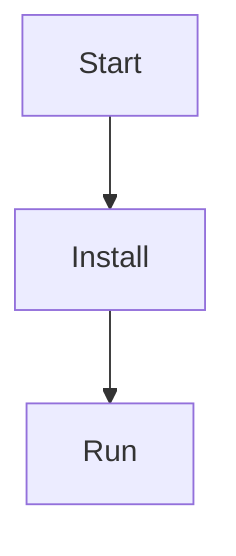

# ชื่อโปรเจกต์

คำอธิบายสั้น ๆ ว่าโปรเจกต์ทำอะไร / เหมาะกับใคร

## Features
- ✅ ...
- ✅ ...
- ✅ ...

## Demo / Screenshot


## Requirements
- Flutter 3.x
- Dart 3.x
- ...

## 1) หัวข้อ (Headings)

```md
# H1
## H2
### H3
#### H4
```

## 2) ตัวหนา/ตัวเอียง/ขีดทับ

```md
**ตัวหนา**
*ตัวเอียง*
~~ขีดทับ~~
```

## 3) รายการ (Lists)

- Bullet
```md
- item
  - sub item
```
- Number
```md
1. step one
2. step two
```
- Task list (เช็กลิสต์)
```md
- [x] done
- [ ] todo
```

## 4) ลิงก์ (Links) และลิงก์แบบ relative
```md
[เปิดเว็บ](https://example.com)

[ไปไฟล์ใน repo](docs/guide.md)
[ไปโฟลเดอร์](lib/)
```

## 5) รูปภาพ (Images)
```md

```
ใส่ขนาดด้วย HTML ได้ (GitHub รองรับ HTML บางส่วน)
```md

```

## 6) โค้ด (Code blocks) + Highlight ภาษา
```dart
void main() => print('hello');
```
```bash
flutter pub get
```
```yaml

GitHub รองรับ fenced code block ด้วย backticks และใส่ชื่อภาษาเพื่อ highlight ได้ :contentReference[oaicite:1]{index=1}

---
```

## 7) ตาราง (Tables)
ต้องมี “บรรทัดว่าง” ก่อนตาราง ไม่งั้นบางครั้ง render เพี้ยน

```md

| Feature | Status | Note |
|---|---:|---|
| Login | ✅ | Firebase Auth |
| Map | ✅ | flutter_map |
| API | ⏳ | in progress |
```

## 8) กล่องเตือนสวย ๆ (Alerts / Callouts)
ใช้ blockquote + ``TYPE``

```md
> [!NOTE]
> โน้ตสำคัญ

> [!TIP]
> ทิป/ทางลัด

> [!IMPORTANT]
> ข้อมูลที่ต้องรู้

> [!WARNING]
> ระวังปัญหา

> [!CAUTION]
> เสี่ยง/ผลเสียที่อาจเกิดขึ้น
```

## 9) พับ/ซ่อนเนื้อหา
```md
<details>
  <summary>ดูขั้นตอนติดตั้งแบบละเอียด</summary>

  - step 1
  - step 2

  ```bash
  flutter doctor
</details>
```

## 10) แผนภาพด้วย Mermaid (ไดอะแกรม)
GitHub รองรับ Mermaid ใน code fence ``mermaid``
```md


## 11) อ้างอิง/Quote/เส้นคั่น
```md
> ข้อความอ้างอิง
```

## 12) ลิงก์ไปหัวข้อ (Anchor)
```md
- [ไปที่ Installation](#installation)
- [ไปที่ Usage](#usage)
```
